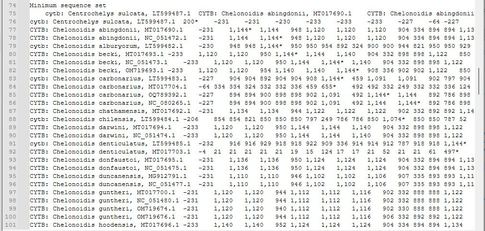
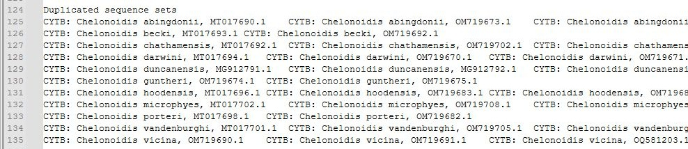
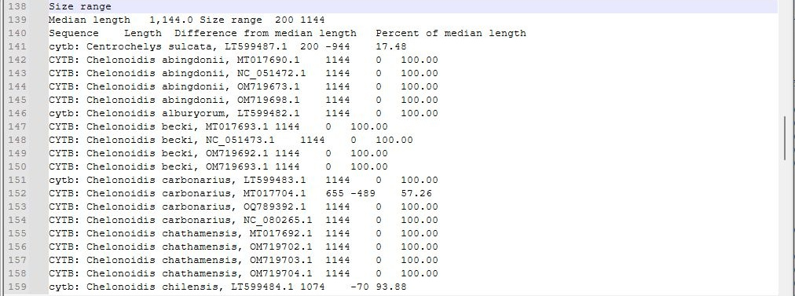
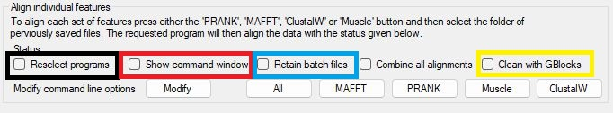
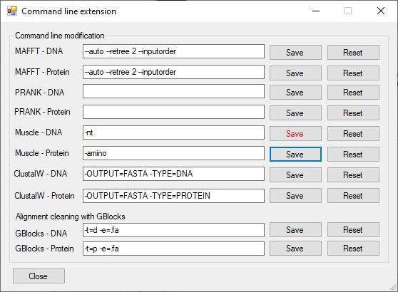

# GeneMatrix User Guide

## Contents

  * [User interface](#user-interface)
  * [Obtaining the sequence files](#obtaining-the-sequence-files)
  * [Importing sequence data](#importing-sequence-data)
  * [Retained data](#retained-data)
    + [Genbank entry level data: accession ID, species name and sequence](#genbank-entry-level-data--accession-id--species-name-and-sequence)
    + [Selection of features to be retained](#selection-of-features-to-be-retained)
      - [Feature's Names](#feature-s-names)
      - [Feature's protein sequence](#feature-s-protein-sequence)
      - [Feature's coordinates](#feature-s-coordinates)
  * [Working with the imported sequences](#working-with-the-imported-sequences)
  * [Selecting sequences for export based on their names](#selecting-sequences-for-export-based-on-their-names)
    + [Amalgamating sequences with different names](#amalgamating-sequences-with-different-names)
    + [Deselecting a sequence for export](#deselecting-a-sequence-for-export)
    + [Deselecting all sequences picked for export](#deselecting-all-sequences-picked-for-export)
  * [Saving the selected gene sequences](#saving-the-selected-gene-sequences)
      - [Sequence names](#sequence-names)
      - [Absent data](#absent-data)
  * [Creating multiple sequence alignments](#creating-multiple-sequence-alignments)
    + [Automation of the alignment process](#automation-of-the-alignment-process)
    + [Getting the alignment tools](#getting-the-alignment-tools)
    + [Selecting the executable file](#selecting-the-executable-file)
    + [Performing the alignment](#performing-the-alignment)
    + [Combining the alignments into a single alignment](#combining-the-alignments-into-a-single-alignment)
    + [Modifying the alignment command](#modifying-the-alignment-command)
    + [Determining the partitioning schemes and models of evolution for phylogenetic analyses](#determining-the-partitioning-schemes-and-models-of-evolution-for-phylogenetic-analyses)
- [Third party applications](#third-party-applications)
  * [Muscle](#muscle)
      - [Command](#command)
      - [Website](#website)
      - [References](#references)
  * [Clustal](#clustal)
      - [Command](#command-1)
      - [Website](#website-1)
      - [References](#references-1)
  * [MAFFT](#mafft)
      - [Command](#command-2)
      - [Website](#website-2)
      - [References](#references-2)
  * [PRANK](#prank)
      - [Command](#command-3)
      - [Website](#website-3)
      - [References](#references-3)
  * [GBlocks](#gblocks-alignment-cleaning)
      - [Command](#command-4)
      - [Website](#website-4)
      - [Reference](#references-4)
  * [PartitionFinder2](#partitionfinder-automated-scheme-selection-for-phylogenetic-analyses)
      - [Command](#command-5)
      - [Website](#website-5)
      - [Reference](#references-5)

<small><i><a href='http://ecotrust-canada.github.io/markdown-toc/'>Table of contents generated with markdown-toc</a></i></small>

## User interface

```GeneMatrix``` consists of a single window split into the five sections: ***Import data***, ***Combine features with different names***, ***Save sequences***, ***Align individual features*** and ***PartitionFinder2***. Each section performs a task as suggested by its name. The upper three sections need to be performed in a set order so only the ***Import data*** option is active. However, since the ***Align individual features*** and ***PartitionFinder2*** work with data saved to disk, they can be used when required and so are always enabled.

<hr />


Figure 1

<hr />


## Obtaining the sequence files

```GeneMatrix``` is designed to work with files downloaded from the NCBI website that consist of a collection of related sequences, such as mitochondrial genomes from species in the same genus or viruses from the same family. For this guide I downloaded 144 mitochondrial genome sequences for the genus Chelonoidis. A description of how to select and download the data is [here](obtainingFiles.md), while the [data file](../ExampleData/sequence.gb) is in the [ExampleData folder](../ExampleData/). 

## Importing sequence data

The  ***Import data*** section consists of just two controls that allow the selection of the data files. To import data, press the ```Import``` button in the lower right of the panel (blue box, Figure 2a). If the ```Folder``` tick box is unchecked, pressing the ```Import``` button will display a file selection dialogue box that will accept files with the *.gb or *.genbank file extension or the *.txt extension for files containing a list of accession IDs. If checked, a folder selection dialogue box will be shown. When importing data from a folder, ```GeneMatrix``` will process any file in the folder with *.gb, *.genbank *.fa or *.fasta file extension. When processing a GenBank file it may contain data on one or more GenBank entries (i.e., mitochondrial or viral genomes); a FASTA file should only contain sequences from a single species/genome.  

If a text file of GenBank accession IDs is imported, ```Genematrix``` expects one ID per line and will download the file from the NCBI site. Due to the NCBI's fair usage policy, you cannot request more than 3 sequences per second; consequently, ```GeneMatrix``` takes at least 350 milliseconds to process each sequence. When downloading each sequence, ```Genematrix``` will displace its accession ID in the title bar.

<hr />


Figure 2: Data is imported by pressing the ```Import``` button.

<hr />

***Note:*** When importing a single file, it is expected that the file contains multiple entries, while when importing a folder of files, each file can contain one or more sequences. If the same accession number is present twice, ```GeneMatrix``` will warn you and give you the option to abort the process, allowing you to remove the duplicated sequences or to continue and ignore the second entry.

Once imported, ```GeneMatrix``` displays the number of retained entries and lists any with no relevant annotation (i.e. GenBank entries that contain no tRNA, rRNA or CDS features); these sequences will be omitted from all subsequent processing (Figure 3 and see [Feature selection](#features-names) below).

<hr />


Figure 3

<hr />

## Retained data

### GenBank files 

When reading an entry, ```GeneMatrix``` identifies the entry's accession number, species name and its sequence as follows:   
* The accession ID is obtained from the line beginning with ___VERSION___.   
* The species name is taken from the line starting with two spaces and then ___ORGANISM___.  
* The sequence is considered as any text after the line starting with ___ORIGIN___ and before the line starting with ___\\\\___. When all the features from an entry have been processed, this sequence data is discarded, with just feature-specific sequence retained. 
 
#### Selection of features to be retained

The level of annotation in GenBank entries is very variable; some entries only have the sequence and genome-level annotation, such as accession ID, species taxonomy and submitter details, while others are extensively annotated. For instance, in the sequence.gb file downloaded in the [Obtaining the sequence files](obtainingFiles.md) section, 18 contain no relevant annotation. Not all of the features are relevant to the production of sequence alignments for phylogenetic studies; consequently, ```GeneMatrix``` limits the features retained to those tagged with the ***CDS***, ***tRNA*** or ***rRNA***. These were selected as they have very well-defined starting and ending points, with their sequence consistent between species, whereas features such as  those linked to the ___variation___, ___gene___ and ___misc_feature___ are not. For example:

* ___variation___: these features are not consistent between species
* ___gene___: these features have poorly defined start and end points, while the interesting sequences are often present in the ___CDS___ features.
* ___misc_feature___: these are poorly defined features with variable meanings between entrie,s resulting in no set feature list between similar GenBank accession sequences.

#### Feature's Names
Due to variation in the annotation of different GenBank entries, when extracting data for a specific feature, ```GeneMatrix``` looks for lines containing the tags: ___/gene=___, ___/product=___,  ___/protein_id=___ and ___/locus_tag=___.  When more than one tag is present, the feature's name is taken as the first tag to be given a value in the order of ___/gene=___, then ___/product=___, followed by  ___/protein_id=___ and finally ___/locus_tag=___.

#### Feature's protein sequence
Typically a ___CDS___ feature is linked to a protein sequence that is found by searching for the ___/translation=___ tag and retaining the subsequence text until a line ending with a __&rdquo;__ is found.  Obviously, ___tRNA___ and ___rRNA___ features are never linked to a protein sequence.  

#### Feature's coordinates
For a short, simple sequence, such as a tRNA or mitochondrial CDS, the sequence is present as a single block of nucleotides. In these situations the coordinates simply follow the feature's tag (___CDS___, ___rRNA___ or ___tRNA___) with the start and end points separated by two periods (Table 1, row 1). In these cases the coordinates of each feature are extracted from the GenBank entry's sequence and stored.  
However, the sequence of a ___CDS___ feature may be contained in a number of exons, or in the case of a circular genome, a feature may span the beginning and the end of the sequence. In these cases, the feature's tag is followed by a series of start/end coordinates separated by commas, with the whole series placed in brackets following the word ___join___ (Table 1, row 2). In these cases the sequence specified by each pair of coordinates is extracted and concatenated to form one sequence.  

|Scenario|Example|
|-|-|
|Contiguous sequence on forward strand| 4226..15369|
|Sequence in two exons on forward strand|join(4226..5266,7492..9002)|
|Contiguous sequence on reverse strand| complement(4226..15369)|
|Sequence in two exons on reverse strand|complement(join(4226..5266,7492..9002))|

Table 1: Feature coordinates

If the feature is encoded on the reverse strand, the coordinates are placed in brackets following the ___complement___ keyword (Table 1, rows 3 and 4). In these cases the sequence is extracted as above and then the reverse complement sequence is determined and stored. This [page](revesreComplement.md) gives the conversion table, including the ambiguous codes.  

Occasionally, the exact coordinates for a sequence are not known, in these cases, the coordinates may contain one or both '<' and '>' characters, suggesting the sequence starts or ends beyond the region suggested. In these situations ```GeneMatrix``` just uses the coordinates supplied, i.e., the entry <1..532 would be treated as 1..532.   
In the data file downloaded in the [Obtaining the sequence files](obtainingFiles.md) section, sequence MG912796.1 contains the sequence for a tRNA-Leu as located at ***complement(<13358)***, in this case, with so little information, the tRNA is ignored.

### FASTA file data

A FASTA file may contain data for a number of different genes, rRNAs or tRNAs, but should only contain data that relates to a single data set. For instance, the genes originated from a single viral genome, mitochondrion or species.   
 If the fasta file was created by the Mitos mitochondrion annotation website hosted on Galaxy, each sequence's name in a fasta file will follow the specific format:

> \>'Species name';'Coordinates in genome sequence';'Strand orientation';'Name'

Consequently, if the name appears to follow this format (it contains exactly three ';' characters), the species and sequence name will be taken from the sequence's name. Also, if the 'Strand orientation' value is given as '-', the saved sequence will be the reverse complement of the sequence in the file. If the sequence name doesn't follow this format, the fasta file's name will be used as the species name and the sequence's name in the file will be used as the gene/feature name. ***Importantly:***
 the sequence will be assumed to be in the forward orientation. 
 
### Important differences between FASTA file data and GenBank data
 
* Fasta files do not contain an accession ID; this value is set to a number that represent how many sequences GenBank entries/fasta files had been previously imported. 

* Fasta files do not contain any information on the sequences type (___CDS___, ___rRNA___ and ___tRNA___); consequently, all the sequences are classified as ___Unknown___.

* Only nucleotide data can be imported in a fasta file, and GeneMatrix does not translate DNA sequence to protein sequence.

## Working with the imported sequences

Once the data has been imported, the ```Combine features with different names``` section becomes active. This area consists of three buttons and two tree view panels with the data arranged as nodes in a tree-like structure. The root of each tree is the ___Sequence___ node; the left-hand tree represents unselected sequences and contains up to four child nodes (___CDS___, ___rRNA___, ___tRNA___ and ___Unknown___), while the right-hand view represents selected sequences and contains three nodes (___CDS___, ___rRNA___ and ___tRNA___). Initially the ___CDS___, ___rRNA___ and ___tRNA___ nodes on the right contain no child nodes, while those on the left contain references to all the imported data as shown by the cross to the right of the text (Figure 4). If no data is found for a feature type, the linked node will not be displayed.

<hr />


Figure 4 Sequence data imported from a folder containing one fasta file and a single multiple-entry GenBank file.

<hr />

```GeneMatrix``` is designed for the collation of orthologous sequences, which is achieved  with user interaction by selecting features with respect to their names rather than similar sequences. This decision was made as it is hoped that the sequences would be correctly annotated, and while this may not be the case, there are many situations where the use of sequence homology can be equally troublesome. For instance, many viruses contain open reading frames that give rise to a number of different proteins through different mechanisms such as RNA editing, ribosome stalling or protein cleavage. What these features represent is typically obvious from the feature's name but may not be that obvious from the sequence, for example:  
* The CDV virus genome contains a PVC or PCV open reading frame that generates the P, V and C proteins; which have overlapping sequences. Some CDV genomes in the [CDV_genomes.gb](../ExampleData/CDV_genomes.gb) file contains a PVC/PCV feature, while other have one or more of the P, V, and C sequences. Trying to group these features based on sequence homology could result in situations where some species have the whole PVC/PCV sequence included while others have the overlapping P, V and C sequences with or without the PVC/PCV sequence, which could ultimately result in erroneous results.  
  
## Identifying duplicate or  miss annotated sequences

The annotation of GenBank sequences is the responsibility of the person that uploads them. As a result, it is not uncommon for sequences to be incorrectly annotated for a variety of reasons; consequently, it is recommended that the imported sequences be scanned in an attempt to identify sequence duplicates and obvious cases of miss-annotation. ```Genematrix``` allows this to be done by either identifying the pairwise homology between sequences of a specific gene or by detecting sequences that are identical or are a fragment of a larger sequence.

Once duplicated or miss-annotated sequences have been identified, they can be filtered to remove unwanted sequences.

***Note***: This analysis is restricted to DNA sequences.

### Identification of identical sequences

 ```GeneMatrix``` is able to detect duplicated sequences that are either identical or the shorter sequence is identical to a section of the longer sequence. If this analysis is performed for a number of genes, the data can be aggregated and used to identify instances where, for instance, two mitochondrial genomes are identical across all genes of interest or just a subset of them.

 To screen gene-specific sequences, click on the required node in the left-hand panel such that the icon turns green. Where a gene is referenced by 2 or more names, select all the relevant nodes (Figure 5).

 <hr >


Figure 5: 

<hr />

To perform the analyses, press the ```Sets``` button below the left-hand panel; this will open the ```Basic Sequence Data``` window that displays the results of the analysis. Each sequence is compared to the other sequences and grouped into sets of identical sequences. The first two lines show the median length and size range of the selected sequences, followed by the tabulated results (Figure 6). 

Each sequence is identified by the accession ID of the GenBank file it was extracted from, its species and gene names. This is followed by the sequence's length and its divergence from the median length in absolute and percentage terms. This is followed by the **set** the sequence belongs to. If a sequence is a fragment of another sequence, this is noted in the final column; for instance, the sequence in the MT017704.1 GenBank file is a fragment of sequences in Set 8. A sequence could be a fragment of multiple sets.   
Pressing the ```Save``` button allows you to save the data to a file.

<hr >


Figure 6:

### Grouping accession files based on the groupings of a number of genes

If each of the GenBank files contains a number of different genes, it's possible to group the GenBank files into sets based on the groupings of the individual genes. To do this, first analyse each gene and save the results to a series of text files in an empty folder. Then press the ```Groupings``` button below the left-hand panel. This will prompt you to select the folder of the results files before opening the ```Aggregated data``` window (Figure 7). Each GenBank file is displayed across one line, with the groupings for each gene present in one column, whose name is taken from the results file's name.   Values preceded by an asterisk (*) indicate that the sequence is a smaller fragment of those in another set. Finally, the data for each selected gene in a GenBank file is used to group the GenBank files based on the gene sequences identity (Figure 7). Once grouped together, it's possible to identify the minimum GenBank file data set required for subsequent analysis. It is also possible to identify instances where sequences have been erroneously allocated to the wrong species or when two species are so closely related that it is debatable if they both need to be included as separate entries.

<hr >


Figure 7:

## Determining the pairwise global homology of a set of sequences

The preceding analysis detects sequences with the same primary sequences: if one base is different, they are classified as different. However, in biological terms, a sequence with a very small number of sequence changes could be considered the same, with the differences being due to sequencing errors or variation within a population.  

To determine the degree of similarity between the sequences linked to selected genes ```GeneMatrix``` can create a table of similarity scores for each pair of sequences in the dataset. ```GeneMatrix``` uses the [Needleman–Wunsch algorithm](https://en.wikipedia.org/wiki/Needleman%E2%80%93Wunsch_algorithm) to create an alignment table and then identifies the global alignment score as the value in the bottom right corner of the grid. If the value equals the length of the sequences, they are identical, while a negative value indicates they are more different than alike. Since the indels and mismatches are scored differently, different alignment scores are not directly comparable. Consequently, values cannot be used to directly compare different alignments but may be informative in indicating a trend.

To perform a pairwise analysis, select the required node(s) as shown in Figure 5 above, and then press the ```Homology``` button under the left-hand panel. This will prompt you to enter the name of the file you wish to save the data to. Once, the file has been selected, the analysis is run in the background and may take a number of minutes to complete. Progress can be seen by opening the file in a text editor such as Notepad++ or Notepad. While the data is not saved until the analysis is complete, the results are 'flushed' to the file as it progresses (Figure 8). Values derived from comparing the sequence to itself are marked with an asterisk. 

<hr >


Figure 8:

Once all the pairwise analyses have been completed, a second table is created that contains the minimum dataset: if two sequences are identical, only one is shown (Figure 9).

<hr >



Figure 9:

<hr >

After the minimum sequence set grid, the sequences found to be identical are listed in the Duplicated Sequence Set table (Figure 10).



Figure 10:

Finally, the sequences are listed along with their length, with its divergence from the median length is noted.

<hr >



Figure 11:

### Considerations for performing multiple concurrent pairwise analyses

In the described analysis, 70 CYTB sequences with a median length of 1,144 bp were compared; this represented approximately 2,500 pairwise comparisons, which is further reduced by noting which sequences are identical. Consequently, each analysis took about 130 milliseconds, totalling about 5 minutes of analysis. To allow you to perform other tasks, the analysis is run on a background thread: once running, the task is detached from the general operation of  ```GeneMatrix's``` user interface and runs until it completes or ```GeneMatrix``` is closed. 

If you have a number of pairwise analyses to complete, you can run them concurrently, but the number of running tasks should not be excessive, as it will degrade the responsiveness of ```GeneMatrix```. Each task requires its own memory allocation; if the tasks use 1 Gb of RAM and you have 4 Gb of RAM, then you should only run ~4 tasks. Finally, if all the data is being saved to a network drive or USB stick, you may need to limit your analysis so access to the storage media is not blocked by other tasks.

## Selecting sequences for export based on their names

Ideally, ```GeneMatrix``` would automate the selection of the features based on their name; however, because features are not named in a consistent, systematic manner, this step requires user interaction. For example, in the [CDV_genomes.gb](../ExampleData/CDV_genomes.gb) file, there are eight different names for the Haemagglutinin protein H ___CDS___ feature (Figure 12). 

<hr >


Figure 12: 

<hr />

Multiple features can be selected at once as long as they all are the same type (i.e., they are all ___CDS___ features). To select an ortholog for inclusion in the exported data set, click on the feature's name in the left-hand panel using the left mouse button. This should change the feature's icon from a light grey to a green. Clicking on the node a second time will deselect it as indicated by the now light grey icon. If an ortholog has multiple names, initially select the node that has the preferred name and then include the other sequences as child sequences as outlined in the next section. Once you have selected all the features, click on the relevant node in the right-hand panel using the mouse's left-hand button. This will move the features from the left-hand tree to the right-hand tree (Figure 13).  

<hr />


Figure 13: In Figure 13a, all the features in the ___CDS___ set except ***cytb***, ***NADH dehydrogenase subunit 1*** and ***NADH dehydrogenase subunit 5*** have been selected. Figure 13b shows the movement of the selected nodes to the right-hand tree after left mouse clicking on the CDS node in the right-hand panel.

### Amalgamating sequences with different names

In Figure 13a it can be seen that the ***NADH dehydrogenase subunit 1*** and ***NADH dehydrogenase subunit 5*** nodes are now child nodes of the ***ND1*** and ***ND5*** nodes, respectively. As a result, features called ***NADH dehydrogenase subunit 1*** will be combined with those called ***ND1*** into a data file called ***ND1***_DNA.fasta or ***ND1***_Protein.fasta. Similarly, ***NADH dehydrogenase subunit 5*** features will be exported with the ***ND5*** features.
To combine the unselected ***cytb*** features with the selected  ***CYTB*** features, left mouse click the ***cytb*** feature in the left-hand panel and then click the ***CYTB*** text using the left mouse button (Figure 14 b). 

<hr />


Figure 14

<hr />

### Working with features in the Unknown dataset

Features with a known type, i.e., they are in one of the  ___CDS___, ___rRNA___ and ___tRNA___ nodes on the left-hand panel, can only be moved to the same node in the right-hand panel. However, features imported from a fasta file have no known type and so are placed in the ___Unknown___ panel. When selecting these sequences, the user can place them in any of the three feature type nodes (___CDS___, ___rRNA___ or ___tRNA___) or one of their child nodes. If a feature of type Unknown, is deselected, it will return to the ___Unknown___ node (see below).

### Deselecting a sequence for export

Deselecting a feature for export is achieved by clicking on the node using the right-hand mouse button. This removes the node from the right-hand tree, returning it to the left-hand tree. If a node contains child nodes, these are removed from the node and also placed in the left-hand tree (Figure 15). If a node was originally from a fasta file, it is returned to the ___Unknown___ node.

<hr />


Figure 15: Right mouse clicking on the ***CYTB*** node in the right-hand panel (Figure 15a), returns both the ***CYTB*** node and its child ***cytb*** to the ***CDS*** node on the left-hand panel.

<hr />

### Saving and importing the amalgamation steps

While the process of selecting and amalgamating features is straightforward, it can become repetitive when reanalysing large dataset as new data is included. Consequently, it is possible to save the current selection process by pressing the ```Save steps``` button in the bottom left of the ```Combine features with different names``` section. This examines the nodes in the right-hand panel, saving the structure to file. 

The table below shows two possible lines from a saved file, the first row indicates that the ***CDS*** node in the right-hand panel should contain the ***CYTB*** node that will be found in the ***CBS*** node in the left-hand panel. The second row indicates that the ***cytb*** node found in the ***CBS*** node in the left-hand panel should be moved to the ***CBS*** > ***CYTB*** node in the right-hand panel.

|Right-hand feature type node|Export feature node|Child feature node|Left-hand feature type node|
|-|-|-|-|
|CDS|CYTB|-|CDS|
|CDS|CYTB|cytb|CDS|

Pressing the Import steps button in the bottom left of the ```Combine features with different names``` section allows you to select a previously saved 'steps' file, which will recreate the desired amalgamation process. Obviously, this process requires the underlying data to be similar. If there is a missmatch for instance, if the current data set doesn't contain a ***CYTB*** feature, ```GeneMatrix``` will ignore this instruction in the first row of the table as well as the line instructing the ***cytb*** feature to be added to the ***CYTB*** node.

### Deselecting all sequences picked for export

The ```Reset``` button in the lower right-hand corner of the ```Combine features with different names``` section allows you to discard the current selection of sequences for export. Pressing it will remove all child nodes of the ___CDS___, ___rRNA___ and ___tRNA___ nodes in the right-hand panel, moving them to the appropriate node in the left-hand panel. 

## Saving the selected gene sequences

When at least one feature has been selected for export the ```Save``` button in the ```Save sequences``` section becomes active (blue box in Figure 16). Pressing this button will prompt you to select a folder to save the data to. If it contains a file with the same name as a file that its exported, the old file will be overwritten (Figure 17).

<hr />


Figure 16

<hr />


Figure 17

<hr />

The ```Save sequences``` section also contains three options: ***Just DNA sequences***, ***Just protein sequences*** and ***Both types of sequence*** (blue box in Figure 16). These options determine whether DNA, protein or both types of sequence data are exported when the ***Save*** button is pressed. Files containing DNA sequences are named \<feature type>-\<feature name>_DNA.fasta, while protein sequence files are called \<feature type>-\<feature name>_Protein.fasta. The \<feature name> is replaced by the sequence's feature name unless it was added as a child to another feature. For instance, in Figure 15a, all DNA sequences represented by the ***ATP6*** name will be stored in a file called ***CDS-ATP6_DNA.fasta***. However, all the sequences linked to ***NADH dehydrogenase subunit 1*** will be saved in the ND1 file, which is called ***CDS-ND1_DNA.fasta***. 

***Note:*** Not all names can be used in file names as they may contain characters that are not allowed, such as '\\', '?' or ":". Consequently, characters that are not letters, numbers, '-', '_', '.' or ' ' are replaced by a '\_' character.

#### Sequence names

The name of the file denotes which feature it contains, while each individual sequence in the file is named after the GenBank's accession ID and the species name: \<Accession ID>-\<Species name>

To make the names compatible with various multiple alignment programs, any space characters are replaced by the '_' character, otherwise the names may be truncated after the first space character in an alignment file generated by programs such as Muscle. For example: ***OQ581203.1-Chelonoidis vicina*** may be reduced to ***OQ581203.1-Chelonoidis***.

#### Absent data

Sequences that are shorter than the longest sequence are padded with space characters to make all sequence lines in a file the same length. If an entry doesn't contain any sequence data for a particular feature and the ___Ignore empty sequences___ is unchecked (red box in Figure 16), the sequence in the exported file will be a series of 'n' (DNA) or 'x' (protein) characters that is the same length as the longest sequence in that set. Whereas, if the sequence is blank and the ___Ignore empty sequences___ is checked, the sequences will not be added to the file. However, if no entries have data (i.e., no tRNA or rRNA feature will have a protein sequence), no file will be produced.

## Creating multiple sequence alignments

The overall aim of extracting the sequences is to create a multi-sequence alignment. This can be done independently of ```GeneMatrix``` or via the controls in the ```Align individual features``` section. These controls allow ```GeneMatrix``` to automate ***Muscle***, ***ClustalW***, ***MAFFT*** and/or ***PRANK*** (if present on your computer) to align all the exported sequence files in a folder. While some of these programs can be run as interactive webpages or desktop applications, they can also be run as console applications using the Windows ***cmd*** shell program (Command Prompt: Figure 22). 

### Very important note

Due to the security concerns, your computer will not allow ```GeneMatrix``` to automate an alignment in special folders, such as OneDrive folders or possibly with aligners saved on a USB stick. Consequently, if an alignment runs very quickly but produces no files, either move everything to a hard drive on your computer or check the option to save the batch command files and then double-click on each file in turn and run them manually. 

### Automation of the alignment process

Aligning the sequences in the files is performed by pressing one of the ```Muscle```, ```PRANK```, ```ClustalW``` or ```MAFFT``` buttons (blue box, Figure 18). If the ```All``` button is pressed ```GeneMatrix``` will process the files with each of the programs in turn.   
***Note:*** To use the programs, the executable(s) must be present on your computer.   
***Note:*** These programs do not require installing and so you don't need admin rights.

<hr />


Figure 18

<hr />

### Getting the alignment tools

The third-party alignment applications used by ```GeneMatrix``` do not require to be installed on your computer and so can be downloaded from the [Program](../Program/) folder, unzipped and then used as described below. 

### Selecting the executable file
To align the sequences, ```GeneMatrix``` first checks if the required program has been used before and whether the executable file still exists. If not, ```GeneMatrix``` looks for the executable file in the same folder as the ```GeneMatrix``` program. If it still hasn't found the program, it will ask you to select the program using a file selection dialogue box. Muscle (muscle5.1.win64.exe) and ClustalW (clustalw2.exe) each consist of a single program file that you need to select. However, ***PRANK*** and ***MAFFT*** require a number of other files to run and so you must download a zip file containing these files (see the [Program](../Program/) folder), unzip them and then select the ___mafft.bat___ file or the ___PRANK.exe___ file. 

If you wish to change the selected program, either simply delete, rename or move the original file or check the ```Reselect programs``` option (black box, Figure 19) and GeneMatrix will prompt you for the location of the file when you start another alignment. See the [third-party alignment applications](#third-party-alignment-applications) for more details regarding each program.

<hr />



Figure 19

<hr />

### Performing the alignment
Once the executable has been found, ```GeneMatrix``` prompts the user to select a folder of saved files and then iterates through these files looking for file names ending in  "_DNA.fasta" or "_protein.fasta". For each file, it creates a batch file that contains the command(s) needed to run the program. This file is then sent to a ```cmd shell``` to process. After each alignment, the batch file is deleted, but if you wish to retain the batch files, checking the ```Retain batch files``` option (blue box, Figure 19) will rename the batch file after the sequence file it processed. If you try to open these files by clicking on them, they will open a ```cmd shell``` window and attempt to rerun the alignment; consequently, to view/edit their contents, drag and drop the file icon onto a text editor, ideally [Notepad++](https://notepad-plus-plus.org/).

By default the ```cmd shell``` window is hidden, meaning the alignment will run in the background with the status shown by ```GeneMatrix``` (blue box, FIgure 20) and the only indication that the alignment is running will be to look for the program in ```Task Manager``` (Figure 21). If you decide to terminate the alignment, you'll have to select the process in the ```Task Manager``` and then kill it (right-click on the program's name and select ```End task```). If you are producing a number of alignments, you may need to rename the folder of files; otherwise ```GeneMatrix``` will just start the next alignment: changing the folder name will mean any attempts to start another alignment will fail, as ```GeneMatrix``` will not know where to find the files.

### Cleaning the alignment with GBlocks

Once the alignment has been created, it is possible to 'clean' the alignment using GBlocks. To do this, check the ___Clean with GBlocks___ option. This will produce a webpage with the ___*.htm___ file extension and a cleaned aligned with the same name as the uncleaned aligned to which ___.fa___ has been added.

<hr />


Figure 20

<hr />


Figure 21: The ```Task Manger``` window showing Muscle (muscle5.1.win64.exe) running. 

<hr />

If the ```Show command window``` option is checked (red box, Figure 19), the ```cmd shell``` window will be shown and the output from the alignment program will be visible (Figure 22). Manually closing the window will kill the alignment. Once the alignment is complete, the ```cmd shell``` window will close, and another one will opend if required.

<hr />


Figure 22: cmd shell window showing the feedback from a Muscle alignment.

<hr />

### Combining the alignments into a single alignment

When identifying the relationship between a number of species it is often performed using an alignment made from a number of alignments for individual genes/features that are concatenated to form a single master alignment. If the ```Combine all alignments``` option is checked, the results of any alignments will be concatenated together to form DNA and/or protein-specific master alignments. The name of the files will consist of the program used to make the alignments and the sequence type (DNA or protein) with the ".fasta" file extension. For example, a master protein alignment created using ***MAFFT*** will be called "MAFFT_protein.fasta"

### Modifying the alignment command

The ([Third-party alignment applications](#third-party-alignment-applications) and [GBlocks alignment cleaning](gblocks-alignment-cleaning)) sections below give a very short description of the alignment and cleaning programs, links to their websites, useful citations, as well as the command used by ```GeneMatrix``` to make the alignment. These commands are very generic and you may wish to modify them. This can be achieved using the ```Command line options``` window that is accessed by pressing the ```Modify button``` (blue box, Figure 23a)

<hr />


Figure 23a

<hr />


Figure 23b

<hr />



Figure 23c: Compared to Figure 23b, the Muscle commands have been extended to include the option to specify the sequence type. The edit for Muscle-DNA has not been saved (```Save``` button text is red), while the Muscle-Protein edit as has (```Save``` button text is black)

<hr />

The current options are displayed in the text area to the right of the program's name and target sequence type. If the text is changed, the font on the ```Save``` button becomes red. Pressing the ```Save``` button will save the new command options, while pressing the ```Reset``` button will set the options to those shown in Figure 23b. 

***Important:*** The text displayed in the text area is inserted into the command line as it appears in the text area and undergoes no error checking. Consequently, it is best to test the options on a single, small dataset before attempting to process a larger dataset.

## Determining the partitioning schemes and models of evolution for phylogenetic analyses

Once the sequences have been aligned, they may be used in a wide range of workflows, such as phylogenetic analysis. A common step of phylogenetic analysis is the determination of the best models and/or schemes for the analysis. This is typically performed using PartitionFinder2, which is a Python application that requires Python 2.7 to run. Since Python 2.7 is no longer supported by a wide range of operating systems, it typically has to be run in a conda environment whose setup is described [here](installinPython2.7.md). 

Due to the complexity of running the PartitionFinder analysis, its implementation is separate from the other programs and done in three steps: 

***Step 1:*** Creating a Phylip-formatted alignment with linked gene boundary data,  
***Step 2:*** Creation of the PartitionFinder configuration file,  
***Step 3:*** Creation of the PartitionFinder2 command and issuing it.

These steps are undertaken via the two buttons (```Make``` and ```Run```) in the ```PatitionFinder2``` panel (Figure 24).


Figure 24

### Creating Phylip alignment and boundary data files

Pressing the ```Make``` button opens the ```PartitionFinder``` window (Figure 25). 


Figure 25

To create the Phylip alignment, first select the folder of individual alignments created by Muscle, Prank, ClustalW, MAFFT or GBlocks by pressing the ```Folder``` button in the upper ```Create Phylip file``` panel. Next, select the required file extension of the alignments using the dropdown list to the right of the ```Folder``` button. If all the alignments have a common suffix, such as ***_DNA_MAFFT.fasta.fa*** this can be entered into the dropdown list (Figure 26), and the number of matching files is shown to the right of the dropdown list control.


Figure 26

If any files meet the filtering step, the ```Create``` button is enabled, and pressing it causes the alignment (Figure 27) and boundary (Figure 28) files to be made and saved to the folder containing the alignments.  


Figure 27


Figure 28 

The boundary files contain the data as a series of lines in the PartitionFinder's blocks format for both non-coding (protein and/or intronic sequences) as well as coding. For example, line 1 in Figure 28 represents non-coding sequences, while lines 2 to 4 represent the blocks for codon positions 1, 2 and 3 of the coding sequence.

### Creating a PartitionFinder2 configuration file

The configuration file (partition_finder.cfg) contains the majority of options required by PartitionFinder2. While ```GeneMatrix``` allows you to create this file, due to the number and scope of parameters ```GeneMatrix``` does not validate all possible combinations; consequently, you need to read the PartitionFinder2 manual to understand which parameters to use.

All options for creating a configuration file are in the lower ```PartitionFinder2 config file creation``` panel. 

#### Adding the alignment file

Pressing the ```Select``` button at the top of the ```PartitionFinder2 config file creation``` panel prompts you to select the Phylip alignment made earlier; its file name will then appear in the text area to the right of the ```Select``` button. Alternatively, you can manually type the name in the text area.

#### Setting the branch lengths

It is possible to set the branch lengths for the analysis to be fixed or sequence block dependent using the ```Linked``` and ```Unlinked``` radio buttons. ***Note*** Not all phylogenetic programs allow Unlinked branch length.

#### Setting the Model of Evolution

The evolution model can be selected from the dropdown list to the right of the ```Model of evolution``` label (Figure 29a). This contains an number of models, with the last entry set to ```List``` (Figures 29b and 22c). If the ```List``` option is selected, the ```DNA``` and ```Amino acid sequence``` radio buttons become active. Toggling these radio buttons changes the labels of the radio buttons below them such that the options match the correct type of sequence. Any combination of these sub-models can be selected. 


Figure 29a


Figure 29b 


Figure 29c 

#### Setting the Schemes option

The dropdown list to the right of the ```Schemes``` label allows the analyses Scheme to be selected (Figure 30).


Figure 30

#### Setting the Model of selection

The dropdown list to the right of the ```Model of selection``` label allows the analysis selection model to be set (Figure 31).


Figure 31

#### Setting the partition blocks 

Pressing the lower ```Select``` button prompts you to select the sequence boundary (*.blocks) made with the Phylip alignment file. The individual genes/sequences are then listed in the checklist control (Figure 32). Selecting an entry in this list indicates that the sequence is coding and so different models for each of the codon positions will be allowed (see figure 32 for entry in the configuration file). 


Figure 32


Figure 32

In Figure 32, the CDS-ATP6 and CDS-COX2 entries are selected. As a result, these sequences have three entries, one for each codon position in the resultant configuration file (Figure 32).

#### Creating the configuration file

Pressing the ```create``` button at the bottom panel prompts you to enter the name and location of the configuration file. While any file name can be entered, it has to be set to ***partition_finder.cfg*** for PartitionFinder2 to find it.

### Configuring the command line arguments and running PartitionFinder2

Pressing the ```Run``` button will prompt you to select the working folder that contains the aligned sequence file (\*.phy) and the partition_finder.cfg before opening the ```PartitionFinder2 command constructor``` (Figure 33). It will also check for the presence of the PartitionFinder2.py and prompt you to select it if not found. It will also check if the partition_finder.cfg directs the use of a cluster algorithm (R-Cluster, R-Cluster-F or H-Cluster) and, if found, include the ***--raxml*** option. It will also check for the presence of an old analysis (folder call ***analysis***), and if found give the option to abort the analysis or force PartitionFinder to overwrite the analysis with the ***--force-restart*** parameter.

```GeneMatrix``` will scan for conda environments in the default locations as well as locations suggested by the user and global PATH variable. If it finds any environments, they will be listed in the dropdown list to the right of the ```Anaconda3``` radio button. If only one environment was found, it will be selected in the list. If more than one was present, the appropriate one should be selected. If the environment was not found, it can manually be entered into the list's text area.

If the ```Anaconda3``` radio button option is checked, the command shown in the lower text area will contain the command line instructions for activating the environment (Figure 33a). If one of the other options is selected, the command will display the required command (Figure 33b).


Figure 33a


Figure 33b

While most of the options are set in the partition_finder.cfg file, there are a number of parameters that can be set on the command line. These can be added by selecting them in the lower dropdown list control and pressing the ```Select``` button (Figures 34a and 34b). To remove them, repeat the process. Some of the options require a numeric value to be included (--processors N, --rcluster-max N, --rcluster-percent N and --weights “Wrate, Wbase, Wmodel, Walpha”). To include the numeric values, select all the command line options and then manually change the 'N' character in text in the lower area to the desired value (Figure 34c). Similarly, for the --weights “Wrate, Wbase, Wmodel, Walpha ” option, change the Wrate, Wbase, Wmodel, and Walpha text, but retain the speech marks. If you modify the text and then add another parameter, all the changes will be lost.


Figure 34a


Figure 34b


Figure 347c

#### Saving the script

Pressing the ```Save``` button allows the command text to be saved as a text file. 

#### Running PartitionFinder2

Pressing the ```Run``` button will save the command(s) as a batch file (*.bat) in the working folder and then run it in a CMD.exe shell. 

***Note:*** The ```Program``` button allows the PartitionFinder2.py to be reselected.

# Third party applications

## Muscle

Muscle v5 was a major rewrite of the original program and is reportedly the most accurate aligner when tested in 2021. The application consists of a single executable file, a copy of which is present in the [Program](../Program/) folder.

```GeneMatrix``` uses the ***align*** command to create the alignment with no parameters other than the name of the input and export file names. The [manual](https://drive5.com/muscle5/manual/cmd_align.html) contains a number of options that can be included by using of the  ```Command line extension``` form as described in the [Modifying the alignment command](#modifying-the-alignment-command) section.

#### Command

> muscle5.1.win64.exe -align \<input file> -output \<results file>

where:
* \<input file> is the fasta file to align
* \<results file > is the name of the file to save the alignment too.

#### Website

https://www.drive5.com/muscle/  
(Manual: https://drive5.com/muscle5/manual/cmd_align.html)

#### References

> RC Edgar. MUSCLE: multiple sequence alignment with high accuracy and high throughput. Nucleic acids research 32 (5), 1792-1797

## Clustal 
The Clustal algorithm was first published in 1988, with the last version released on the 17th, Oct 2010. It is available as a desktop, console and web server application, with a number of sites hosting the web server. While it is old, it is still routinely used to create multiple sequence alignments. 

Like Muscle, ClustalW consists of a single executable file, a copy of which is present in the [Program](../Program/) folder.

#### Command

```GeneMatrix``` uses a generic command to create the alignment with just four parameters, which indicate the type of sequence (DNA or protein), and directs the aligned data to be exported as a fasta file. The command also contains the names of the input and export files. The [manual](http://www.clustal.org/download/clustalw_help.txt) (search for section >> Help 9 <<) contains a number of options which can be included by use of the  ```Command line extension``` form as described in the [Modifying the command line options](#modifying-the-command-line-options) section.


The standard command issued to Clustalw2 is:

> clustalw2.exe -INFILE=[input file] -TYPE=[DNA or PROTEIN] -OUTPUT=FASTA -OUTFILE=[results file]

where:
* [input file] is the fasta file to align.
* [DNA or protein] is the type of sequence to align.
* [results file] is the name of the file to save the alignment to.

#### Website

http://www.clustal.org/clustal2/  
(Manual: http://www.clustal.org/download/clustalw_help.txt)
#### References

First publication: 
> Higgins,D.G. and Sharp,P.M. (1988). CLUSTAL: a package for performing multiple sequence alignment on a microcomputer. Gene, 73, 237-244.

Last publication:
> Larkin MA, Blackshields G, Brown NP, Chenna R, McGettigan PA, McWilliam H, Valentin F, Wallace IM, Wilm A, Lopez R, Thompson JD, Gibson TJ, Higgins DG.
(2007). Clustal W and Clustal X version 2.0. Bioinformatics, 23, 2947-2948.

## MAFFT

MAFFT was designed to align sequences that may have large insertions/deletions, such as rRNA that may have variable loop regions. It can align the data via  a number of different algorithms. ```GeneMatrix``` uses the --auto option, which prompts MAFFT to select the most appropriate option.

MAFFT was originally written to run on Linux machines, and it requires a number of other applications to run on a Windows computer. Consequently, MAFFT is bundled with these secondary programs in a zip file (a copy of which is present in the [Program](../Program/) folder). To use MAFFT, extract the zip file and when prompted, select the ___mafft.bat___ file in the ___mafft-win___ folder. 

#### Command

As with the other programs, the command line can be modified using the ```Command line extension``` form as described in the [Modifying the command line options](#modifying-the-command-line-options) section.

> mafft --auto --retree 2 --inputorder [input file (Linux)] \> [results file (Linux)]

where:
* --auto:  prompts MAFFT to use the best options for the alignment: from L-INS-i, FFT-NS-i and FFT-NS-2, according to data size (see its website for details).
* --retree 2: Guide tree is built twice (2) in the progressive stage.
* --inputorder: Order of sequences in the alignment is the same as their order in the input file.
* [input file (Linux)] is the fasta file to align.  The file name uses the Linux '/' rather than the Windows '\\' separators.
* [results file (Linux)] is the name of the file to save the alignment to.  The file name uses the Linux '/' rather than the Windows '\\' separators.


***Note***: while for the other programs it is possible to hide the ___CMD___ window, for MAFFT to work with the GBlocks program, the window needs to be visible.

#### Website

https://mafft.cbrc.jp/alignment/server/index.html (see links on the left of the webpage)  
(Manual: https://mafft.cbrc.jp/alignment/software/manual/manual.html)

#### References

First publication
> Katoh K, Misawa K, Kuma K, Miyata T. MAFFT: a novel method for rapid multiple sequence alignment based on fast Fourier transform. Nucleic Acids Res. 2002;30:3059-66

Last publication
> Katoh K, Standley DM. MAFFT multiple sequence alignment software version 7: improvements in performance and usability. Mol Biol Evol. 2013;30:772-80. 

## PRANK

According to its website, PRANK is a probabilistic multiple alignment program for DNA, codon and amino acid sequences. It’s based on a novel algorithm that treats insertions correctly and avoids over estimation of the number of deletion events.

Like MAFFT, PRANK was written to run on Linux computers and so needs a number of secondary applications to run. These are all present in the zip file in the [Programs](../Program/) folder. To use PRANK, unzip the file and when prompted, select the ___MAFFT___ file in the 'prank' > 'bin' folder.

#### Command
prank.exe -d=[input file (Linux)] -o=[results file (Linux)]

where:
* [input file (Linux)] is the fasta file to align. The file name uses the Linux '/' rather than the Windows '\\' separators.
* [results file (Linux)] is the name of the file to save the alignment to.  The file name uses the Linux '/' rather than the Windows '\\' separators.

#### Website

https://ariloytynoja.github.io/prank-msa/   
(Manual/main options: https://ariloytynoja.github.io/prank-msa/#main-program-options)

#### References

> Löytynoja, A. (2014). Phylogeny-aware alignment with PRANK. In: Russell, D. (eds) Multiple Sequence Alignment Methods. Methods in Molecular Biology, 1079:155-70.

## GBlocks alignment cleaning

mannerAccording to its website: Gblocks eliminates poorly aligned positions and divergent regions of an alignment of DNA or protein sequences. It selects blocks in a similar manner as to when it is done by hand but following a reproducible set of conditions. The selected blocks must fulfill certain requirements with respect to the lack of large segments of contiguous nonconserved positions, lack of gap positions, and high conservation of flanking positions, making the final alignment more suitable for phylogenetic analysis.

GBlocks creates two files, a FASTA file with the cleaned alignment and a webpage (*.htm) that displays a colour coded alignment with secondary information.

#### Command

GBlocks.exe [input file]  -t=[sequence type] -e=.fa

where:
* [input file] is the name, with the path of the original alignment file.
* -t=[sequence type] indicates the sequence type (-t=d for DNA and -t=p for protein).
* -e=.fa directs GBlocks to name the cleaned alignment to a file with the same name as the input file to which '.fa' has been appended.
#### Website

https://www.biologiaevolutiva.org/jcastresana/Gblocks.html   
(Manual: https://www.biologiaevolutiva.org/jcastresana/Gblocks/Gblocks_documentation.html)

#### References

First publication

> Castresana, J. (2000). Selection of conserved blocks from multiple alignments for their use in phylogenetic analysis. Molecular Biology and Evolution 17, 540-552.

Last publication

> Talavera, G., and Castresana, J. (2007). Improvement of phylogenies after removing divergent and ambiguously aligned blocks from protein sequence alignments. Systematic Biology 56, 564-577.

## PartitionFinder: automated scheme selection for phylogenetic analyses 

Running PartitionFinder2 requires Python 2.7, since the current version of Python installed as standard is Python 3.12.8, PartitionFinder requires a non-standard installation of Python. Since this can clash with a standard Python 3.X installation, Python 2.7 is best installed within a conda environment as described [here](installinPython2.7.md).

#### Command

The majority of parameters are set in a configuration file that is in a folder that also contains the alignment file and to which the results are saved. The program requires an old version of the Python and may have to be run in a conda environment. The basic command once the correct Python environment is set up is:

> python PartitionFinder.py <data folder>

where: 
* python references the Python 2.7 installation.
* <data folder> is the folder, with its path, that contains the **partition_finder.cfg** configuration file and the Phylip-formatted alignment file.

#### Website

https://www.robertlanfear.com/partitionfinder/  
(Manual: https://www.robertlanfear.com/partitionfinder/assets/Manual_v2.1.x.pdf,  
Tutorial: https://www.robertlanfear.com/partitionfinder/tutorial/)

#### References

PartitionFinder3 builds on the work of a number of papers and the authors state:

**"Depending on your analysis, you may need to cite up to three papers. One for 
PartitionFinder2, one for the algorithm you use (if you use the rcluster, hcluster, or 
kmeans options), and one for either PhyML or RAxML."**

##### PartitionFinder2 
If you any of this program in any published work please cite:   
> Lanfear, R., Frandsen, P. B., Wright, A. M., Senfeld, T., Calcott, B. (2016) 
PartitionFinder 2: new methods for selecting partitioned models of evolution for 
molecular and morphological phylogenetic analyses. Molecular biology and evolution. 
2017 Mar 1;34(3):772-773   

##### Using search = ‘rcluster’ or search = ‘hcluster’ 
These algorithms are described in the following paper, if you use them please cite: 
> Lanfear, R., Calcott, B., Kainer, D., Mayer, C., & Stamatakis, A. (2014). Selecting 
optimal partitioning schemes for phylogenomic datasets. BMC evolutionary 
biology, 14(1), 82.   

##### Using search = ‘kmeans’ 
This algorithm is described in the following paper, if you use it please cite: 
> Frandsen, P. B., Calcott, B., Mayer, C., & Lanfear, R. (2015). Automatic selection of 
partitioning schemes for phylogenetic analyses using iterative k-means clustering of site 
rates. BMC Evolutionary Biology, 15(1), 13. 

##### PhyML 
If you use PF2 without the --raxml command line option, PF2 relies heavily on PhyML 
version 3.0, so please cite:   
> New Algorithms and Methods to Estimate Maximum-Likelihood Phylogenies: Assessing 
the Performance of PhyML 3.0. Guindon S., Dufayard J.F., Lefort V., Anisimova M., 
Hordijk W., Gascuel O. Systematic Biology, 59(3):307-21, 2010. 

##### Using the --raxml command line option 
If you use the --raxml commandline option, PF2 uses RAxML v8.0 for calculations. If 
you use it, please cite: 
> A. Stamatakis, RAxML-VI-HPC: maximum likelihood-based phylogenetic analyses with 
thousands of taxa and mixed models, Bioinformatics 22, 2688–2690 (2006)
