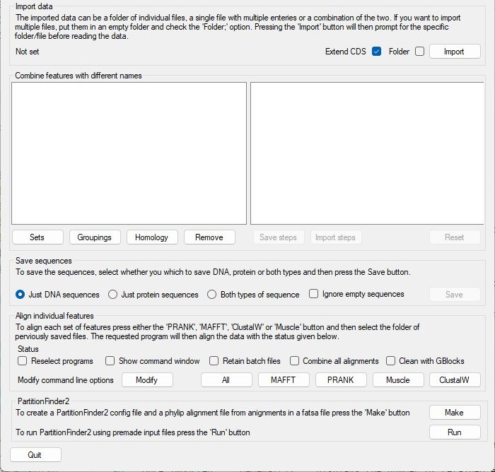
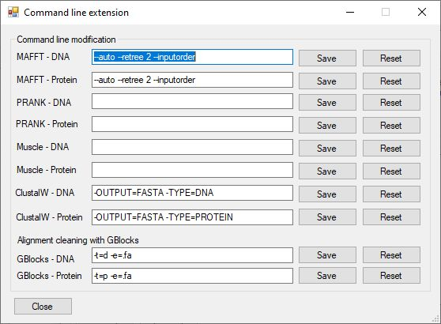

# GeneMatrix User Guide

## Contents

## User interface

```GeneMatrix``` consists of a single window split in to the four sections: ***Import data***, ***Combine features with different names***, ***Save sequence*** and ***Align individual features***. Each section performs a task as suggested by its name. The upper three section need to be performed in a set order so only the ***Import data*** option is active. However, since the ***Align individual features*** works with data saved to disk it can be user when required and so is always enabled.

<hr />



Figure 1

<hr />


## Obtaining the sequence files

```GeneMatrix``` is designed to work with files downloaded from the NCBI web site that consist of a cohort of related sequences such as mitochondrial genomes from species in the same genus or viruses from the same family. For this guide I downloaded 144 mitochondrial genome sequences for the genus Chelonoidis. A fuller description of how to selection and download download the data is [here](obtainingFiles.md) while the [data file](../ExampleData/sequence.gb) is in the [ExampleData folder](../ExampleData/). 

## Importing sequence data

The  ***Import data*** section consists of just two controls which allow the selection of the data files. To import data press the ```Import``` button in the lower right of the panel (blue box Figure 2 a). If the ```Folder``` tick box is unchecked, pressing the ```Import``` button will result in a file selection dialogue box appearing that will accept files with a *.gb or *.genbank file extensions, while if checked, a folder selection dialogue box will be shown. When importing data from a folder, ```GeneMatrix``` will process any file in the folder with either the *.gb or *.genbank file extension, with each file containing one or more sequences.  

<hr />


Figure 2: Data is imported by pressing the ```Import``` button.

<hr />

***Note:*** When importing a single file it is expected that the file contains multiple sequence, while when importing a folder of files each file can contain one or more sequences. If the same accession number is present twice, ```GeneMatrix``` will warn you and give the option to abort the process allowing you to remove the duplicated sequences or allow you to continue and ignoring the 2nd copy.

Once imported ```GeneMatrix``` states the number of retained entries and lists any with no relevant annotation (contained no tRNA, rRNA or CDS features): these sequences will be omitted from all subsequent processing (Figure 3 and see [Feature selection](#features-names) below).

<hr />


Figure 3

<hr />

## Retained data

### Genbank entry level data: accession ID, species name and sequence
When reading an entry, ```GeneMatrix``` identifies the entry's accession number, species name and its sequence as follows:   
* The accession ID is obtained from the line beginning with ___VERSION___.   
* The species name is taken from the line starting with two spaces and then ___ORGANISM___.  
* The sequence is considered as any text after the line starting with ___ORIGIN___ and before the starting with ___\\\\___. When all the features from an entry have been stored the sequence data is discarded. 
 
### Selection of sequences to be retained

The level of annotation in GenBank entries is very variable, some entries only have the sequence and genome level annotation such as accession ID, species taxonomy and submitter details, while other are extensively annotated. For instance in the sequence.gb file downloaded in the [Obtaining the sequence files](obtainingFiles.md), 18 contain no relevant annotation. Not all of the features are relevant to the production of sequence alignments for phylogenetic studies consequently, ```GeneMatrix``` limits the features retain to those tagged with the CDS, tRNA or rRNA. These were selected as they have very well defined starting and ending points, with their sequence consistent between species, whereas features such as  those linked to the ___variation___, ___gene___ and ___misc_feature___ are not. For example:

* ___variation___ : these features are not consistent between species
* ___gene___: poorly defined start and end points with interesting sequences present in the ___CDS___ features
* ___misc_feature___: these are poorly defined features with variable meanings between entries resulting in no set feature list between similar GenBank accession sequences.

#### Feature's Names
Due to variation in the annotation of different GenBank entries, when extracting data for a specific feature ```GeneMatrix``` looks for lines containing the tags: ___/gene=___, ___/product=___,  ___/protein_id=___ and ___/locus_tag=___.  When more than one tag is present, the feature's name is taken as the first tag to be given a value in the order of ___/gene=___ then ___/product=___ followed by  ___/protein_id=___ and finally ___/locus_tag=___.

#### Protein sequence
Typically a ___CDS___ feature is linked to a protein sequence which is found by searching for the ___/translation=___ tag and retaining the subsequence text until a ine ending with a __&rdquo;__ is found.  Obviously ___tRNA___ and ___rRNAs___ never linked to a protein sequence.  

#### Sequence coordinates
For a short, simple sequence such as a tRNA or mitochondrial CDS, the sequence is present as a single run of nucleotides. In these situations the coordinates simply follow the feature's tag (___CDS___, ___rRNA___ or ___tRNA___) with the start and end points separated by two periods (Table 1, row 1). In these cases the coordinates of each feature are extracted from the GenBank entry's sequence and stored.  
However, the sequence of a ___CDS___ feature may be contained in a number of exons or in the case of a circular genome a feature may span the beginning and the end of the sequence. In these cases the feature's tag is followed by a series of start/end coordinates separated by commas with the whole series placed in brackets following the word ___join___ (Table 1, row 2). In these case the sequence identified each pair of coordinates is extracted and concatenated to form one sequence.  

|Scenario|Example|
|-|-|
|Contiguous sequence on forward strand| 4226..15369|
|Sequence in two exons on forward strand|join(4226..5266,7492..9002)|
|Contiguous sequence on reverse strand| complement(4226..15369)|
|Sequence in two exons on reverse strand|complement(join(4226..5266,7492..9002))|

Table 1: Feature coordinates

If the feature is encoded on the reverse strand, the coordinates are places in brackets following the complement key word (Table 1, rows 3 and 4). In these cases the sequence is extracted as above and then the reverse complement sequence is determined and stored. This [page](revesreComplement.md) gives the conversion table including the ambiguous codes.  

Occasionally, the exact coordinates for a sequence are not know, in these cases the coordinates may contain one or both '<' '>' characters suggesting the sequences starts or ends beyond the region suggested. In these situations ```GeneMatrix``` just uses the coordinates supplied i.e. the entry: <1..532 would be treated as: 1..532.   
In the data file downloaded in the [Obtaining the sequence files](obtainingFiles.md) section, sequence MG912796.1 contains the sequence for a tRNA-Leu as located at ***complement(<13358)***, in this case with so little information the tRNA is ignored.


## Working with the imported sequences

Once the data has been imported, the ```Combine features with different names``` section becomes active. The area consists of two tree view panels with the data arranged as nodes in a tree like structure. The root of the trees is the ___Sequence___ node, which contains up to three child nodes (___CDS___, ___rRNA___ and ___tRNA___). The panel on the left represents  unselected data, while the panel on the right represents the selected features. Consequently, initially the ___CDS___, ___rRNA___ and ___tRNA___ nodes on the right contain no child nodes, while those on the left do as shown by the cross to the right of the text (Figure 4). If no data is found for a feature type, the linked node will not be displayed.

<hr />


Figure 4

<hr />

```GeneMatrix``` is designed for the collation of orthologue sequences, which is achieved  with user interaction by selecting features with the required names rather than similar sequences. This decision was made as it is hoped that the sequences would be correctly annotated, and while this may not be the case, there are many situation where the use of sequence homology can be equally troublesome. For instance, many viruses contain open reading frames which give rise to a number of different proteins though different mechanisms such as RNA editing, ribosome stalling or protein cleavage. What these features represent is typically obvious from the feature's name, but may not be that obvious from the sequence, for example:  
* The CDV virus genome contains a PVC or PCV open reading frame that generates the P, V and C proteins which have overlapping sequences. Some CDV genomes in the [CDV_genomes.gb](../ExampleData/CDV_genomes.gb) file contains a PVC/PCV feature, while other have one or more of the P, V, and C sequences. Trying to group these features base on sequence homology could result in situations where some species have the whole PVC/PCV sequence included while others had the overlapping P, V and C sequences with or without the PVC/PCV sequence, which could ultimately result in erroneous results.  
  
## Selecting sequences for export based on their names

Ideally, ```GeneMatrix``` would automate the selection of the features based on their name, however, because features are not named in a consistent, systematic manner in this step requires user interaction. For example, in the [CDV_genomes.gb](../ExampleData/CDV_genomes.gb) file, there are eight different names for the Haemagglutinin protein H ___CDS___ feature. 

<hr >


Figure 5: 

<hr />

Multiple features can be selected at once as long as they all are the same type (i.e. they are all ___CDS___ features.) To select an orthologue for inclusion in the exported data set, click on the feature's name in the left hand panel using the left mouse button. This should change the features's icon from a light grey to a green. Clicking on the node a second time will deselect it as indicated by the now light grey icon. If an orthologue has multiple names, initially select the node which has the preferred name and then include the other sequences as outlined in the next section. Once you have selected all the features, click on the relevant node in the right hand panel using the mouse's left hand button. This will move the features from the left hand tree to the right hand tree (Figure 6).  

<hr />


Figure 6: In Figure 6 a, all the features in the ___CDS___ set except ***cytb***, ***NADH dehydrogenase subunit 1*** and ***NADH dehydrogenase subunit 5*** have been selected. Figure 6 b shows the movement of the selected nodes to the right hand tree after left mouse clicking on the CDS node in the right hand panel.

### Amalgamating sequences with different names

In Figure 7 a it can be seen that the ***NADH dehydrogenase subunit 1*** and ***NADH dehydrogenase subunit 5*** nodes are now child nodes of the ***ND1*** and ***ND5*** nodes respectively. As a result, features with the ***NADH dehydrogenase subunit 1*** name will be combined with those called ***ND1*** in to a data set called ***ND1***. Similarly, ***NADH dehydrogenase subunit 5*** features will be exported with the ***ND5*** features.
To combine the unselected ***cytb*** features with the selected  ***CYTB*** features, left mouse click the ***cytb*** feature in the left hand panel and then click the ***CYTB*** text using the left mouse button (Figure 7 b). 

<hr />


Figure 7

<hr />

### Deselecting sequences for export

Deselecting a feature for export is achieved by clicking on the node using the right hand mouse button. This removes the node from the right hand tree, returning it to left hand tree. If a node contains child nodes, these are removed from the node and also placed in the left hand tree (Figure 8). 

<hr />


Figure 8: Right mouse clicking on the ***CYTB*** node in the right hand panel (Figure 8 a), returns both the the ***CYTB*** node and its child ***cytb*** to the ***CDS*** node on the left hand panel.

<hr />


### Deselecting all sequences picked for export

The ```Reset``` button in the lower right hand corner of the ```Combine features with different names``` section allows you to discard the current selection of sequences for export. Pressing it will remove all child nodes of the ___CDS___, ___rRNA___ and ___tRNA___ nodes in the right hand panel, moving them to the appropriate node in the left hand panel. 


### Saving the selected gene sequences

Once at least one feature has been selected for export the the ```Save``` button in the ```Save sequences``` section becomes active (blue box in Figure 9). Pressing this button will prompt you to select a folder to save the data too. If it contains a file with the same name as a file that its exported, the old file will be overwritten (Figure 10).

<hr />


Figure 9

<hr />


Figure 10

<hr />

The ```Save sequences``` section also contains three options: ***Just DNA sequences***, ***Just protein sequences*** and ***Both types of sequence*** (red box in Figure 9). These options select whether DNA, protein or both types of sequence data are exported when the ***Save*** button is pressed. Files containing DNA sequences are named \<feature type>-\<feature name>_DNA.fasta, while protein sequence files are called \<feature type>-\<feature name>_Protein.fasta. The \<feature name> is replaced by the sequence's feature name unless it was added as a child to another term. For instance in Figure 8a, all DNA sequences represented by the ***ATP6*** name will be stored in a file called ***CDS-ATP6_DNA.fasta***. However, all the sequences linked to ***NADH dehydrogenase subunit 1*** will be saved in the parent's file which is called ***CDS-ND1_DNA.fasta***. 

Not all names can be used in file names as some contain characters that are not allowed such as '\\', '?' or ":". Consequently, characters that are letters, numbers, '-', '_', '.' or white space are replaced by a '\_' character.

#### Sequence names

The name of the files denotes which feature it contains, while each individual sequence in the file is named after the GenBank's accession ID and the species name:

    <Accession ID>-<Species name>

To make the names compatible with various multiple alignment programs, any space characters are replaced by a '_', otherwise the names may be truncated in an alignment file generated by programs such as Muscle. 

#### Absent data

Sequences that are shorter than the longest sequence are padded with space characters to make all sequences the same length. If a GenBank entry doesn't contain any sequence data for a particular feature, its sequence in the exported file will be a series of 'n' (DNA) or 'x' (protein) characters that is the same length as the longest sequence in that set. However, if no entries have data (i.e. no tRNA or rRNA feature will have a protein sequence) no file will be produced.


## Creating multiple sequence alignments

The overall aim of extracting the sequences is to create a multi-sequence alignment. This can be done independent of ```GeneMatrix``` or via the controls in the ```Align individual features``` section. These controls allow ```GeneMatrix``` to automate ***Muscle***, ***ClustalW***, ***MAFFT*** and/or ***PRANK*** (if present on your computer) to align all the exported sequence files in a folder. While some of these programs can be run as interactive webpages, they can also be run a console applications using Windows ***cmd*** shell program. 

### Automation of the alignment

Aligning the sequences in the files is preformed by pressing one of the ```Muscle```, ```PRANK```, ```ClustalW``` or ```MAFFT``` buttons (blue box, Figure 11). If the ```All``` button is pressed ```GeneMatrix``` will process the files with each of the programs in turn. ***Note:*** To use the programs the executable(s) must be present on your computer.  

<hr />


Figure 11

<hr />

#### Finding the executable file
To align the sequences, ```GeneMatrix``` first checks if the required program has been used before and whether the executable file still exists. If not, ```GeneMatrix``` looks for the executable file in the same folder as the ```GeneMatrix``` program. If it still hasn't found the program it will ask you to select the program using a file selection dialogue box. Muscle (muscle5.1.win64.exe) and ClustalW (clustalw2.exe) each consists of a single program file which you need to select. However, ***PRANK*** and ***MAFFT*** require a number of other files to run and so you must download a zip file (currently prank.windows.140603.zip and mafft-7.520-win64-signed.zip respectively) containing these files (See the [Program](../Program/) folder), unzip it and then select the ___mafft.bat___ file or the ___PRANK.exe___ file. 

If you wish to change the selected program either simply delete/rename/move the original file or check the ```Reselect programs``` option (black box, Figure 12) and GeneMatrix will prompt you for the location of the file when you start another alignment step. See the [Third party alignment applications](#third-party-alignment-applications) for more details regarding each program.

<hr />


Figure 12

<hr />

#### Performing the alignment
Once the executable has been found, ```GeneMatrix``` prompts the user to select a folder of saved files and then iterates through these files looking for file names ending in  "_DNA.fasta" or "_protein.fasta". For each file, it creates a batch file which contains the commands needed to run the program in a cmd shell which is then sent a cmd shell to process. After each alignment, the batch file is deleted, but if you wish to retain the batch files, checking the ```Retain batch files``` option (blue box, Figure 12) will rename the batch file after the sequence file it processed. If you try to open these files by clicking on them, they will open a cmd shell window and attempt to rerun the alignment, consequently, to view/edit their contents drag and drop the file icon on to a text editor ideally [Notepad++](https://notepad-plus-plus.org/).

By default the cmd shell window is hidden meaning the alignment will run in the background with the status shown by ```GeneMatrix``` (blue box, FIgure 13) and the only indication that the alignment is running will be to look for the program in ```Task Manager``` (Figure 14). If you decide to terminate the alignment, you'll have to select the process in the ```Task Manager``` and then kill it. If you have a number of alignments to perform, you may need to rename the folder, otherwise ```GeneMatrix``` will just start the next alignment: changing the folder name will mean any attempts to start another other analysis will fail as GeneMatrix will not know where to find the files.

<hr />


Figure 13

<hr />


Figure 14: The ```Task Manger``` window showing Muscle (muscle5.1.win64.exe) running. 

<hr />

If the ```Show command window``` option is checked (Red box, Figure 12), the cmd shell window will be shown and the output from the alignment program will be visible (Figure 15). Manually closing the window will kill the alignment. Once the alignment is complete the cmd shell window will close, and another one opened if required.

<hr />


Figure 15: cmd shell window showing the feedback from a Muscle alignment.

<hr />

#### Combining the alignments into a single alignment

When identifying the relationship between a number of species it is often performed using an alignment made from a number of alignments for individual genes/features which are concatenated to form a single master alignment. If the ```Combine all alignments``` option is checked, the results of any alignments will be concatenated together to form DNA and/or protein specific master alignments. The name of the files will consist the program used to make the alignments and the sequence type (DNA or protein) with the ".fasta" file extension. For example a master Protein alignment created using ***MAFFT*** will be called "MAFFT_protein.fasta"

### Modifying the alignment command

The sections below give a very short description of the alignment programs, links to their websites, the first and last citation as well as the command used by ```GeneMatrix``` to make the alignment. These commands are very generic and you may wish to modify them. This can be achieved using the ```Command line options``` form that is accessed by pressing the Modify button (blue box, Figure 16 a)

<hr />


Figure 16 a

<hr />



Figure 16 b

<hr />


Figure 16 c: Compared to Figure 16 b, the Muscle commands have been extended to include the option to specify the sequence type. The edit for Muscle - DNA has not been saved (```Save``` button text is red), while the Muscle - Protein edit as has (```Save``` button text is black)

<hr />

The current options are displayed in the text area to the right of the programs name and target sequence type. If the text is changed, the font on the ```Save``` button becomes red. Pressing the ```Save``` button will save the new command options, while pressing the ```Reset``` button will set the options to those shown in Figure 16 c. 

The text displayed in the text area is inserted into the command line as written and undergoes you error checking. Consequently, it is best to test the options on a single, small dataset before attempting to process a larger dataset.

# Third party alignment applications

## About Muscle

Muscle v5 was a major rewrite of the original program and is reportedly the most accurate aligner when tested in 2021. The application consists of a single executable file, a copy of which is present in the [Program](../Program/) folder.

```GeneMatrix``` uses the ***align*** command to create the alignment with no parameters other than the name of the input and export file names. The [manual](https://drive5.com/muscle5/manual/cmd_align.html) contains a number of options which can be included by use of the  ```Command line extension``` form as described in the [Modifying the alignment command](#modifying-the-alignment-command) section.

#### Command

> muscle5.1.win64.exe -align \<input file> -output \<results file>

where:
* \<input file> is the fasta file to align
* \<results file > is the name of the file to save the alignment too.

##### Website

https://www.drive5.com/muscle/  
(Manual: https://drive5.com/muscle5/manual/cmd_align.html)

##### References

> RC Edgar. MUSCLE: multiple sequence alignment with high accuracy and high throughput. Nucleic acids research 32 (5), 1792-1797

## About Clustal 
The Clustal algorithm was first published in 1988 with the last version released in 17th, Oct 2010. It is available as a desktop, console and web server application, with a number of sites hosting the web server. While it is old, it is still routinely used to create multiple sequence alignments. 

Like Muscle, ClustalW consists of a single executable file, a copy of which is present in the [Program](../Program/) folder.

#### Command

```GeneMatrix``` uses a generic command to create the alignment with just four parameters which indicate the type of sequence (DNA or protein) and asking the aligned data to be exported as a fasta file a long with the names of the input and export files. The [manual](http://www.clustal.org/download/clustalw_help.txt) (search for section >> Help 9 <<) contains a number of options which can be included by use of the  ```Command line extension``` form as described in the [Modifying the command line options](#modifying-the-command-line-options) section.


The standard command issued to Clustalw2 is:

> clustalw2.exe -INFILE=[input file>]-TYPE=[DNA or PROTEIN] -OUTPUT=FASTA -OUTPUT=FASTA -OUTFILE=[results file]

where:
* [input file] is the fasta file to align
* [DNA or protein] is the type of sequence to align.
* [results file] is the name of the file to save the alignment too.

##### Website

http://www.clustal.org/clustal2/  
(Manual: http://www.clustal.org/download/clustalw_help.txt)
##### References

First publication: 
> Higgins,D.G. and Sharp,P.M. (1988). CLUSTAL: a package for performing multiple sequence alignment on a microcomputer. Gene, 73, 237-244.

Last publication:
> Larkin MA, Blackshields G, Brown NP, Chenna R, McGettigan PA, McWilliam H, Valentin F, Wallace IM, Wilm A, Lopez R, Thompson JD, Gibson TJ, Higgins DG.
(2007). Clustal W and Clustal X version 2.0. Bioinformatics, 23, 2947-2948.

### About MAFFT

MAFFT was designed to align sequences that may have large gaps such as rRNA that may have variable loop regions. It can align the data via  a number of different algorithms. ```GeneMatrix``` uses the --auto options which prompts MAFFT to select the most appropriate option.

MAFFT was originally written to run on Linux machines and it requires an number of other applications to run on a Windows machine. Consequently, the MAFFT is bundled with these secondary programs in a zip file (a copy of which is present in the [Program](../Program/) folder). To use MAFFT, extract the zip file and when prompted select the ___mafft.bat___ file in the ___mafft-win___ folder. 

#### Command

As with the other programs the command line can be modified using the ```Command line extension``` form as described in the [Modifying the command line options](#modifying-the-command-line-options) section.

> mafft --auto --retree 2 --inputorder [input file (Linux)] \> [results file (Linux)]

where:
* --auto - prompts MAFFT to use the best options for the alignment: rom L-INS-i, FFT-NS-i and FFT-NS-2, according to data size.
* --retree 2 - Guide tree is built number times in the progressive stage. Valid with 6mer distance. Default: 2 
* --inputorder - Output order: same as input.
* [input file] is the fasta file to align.  The file name uses the Linux '/' rather than the Windows '\\' separators.
* [results file] is the name of the file to save the alignment too.  The file name uses the Linux '/' rather than the Windows '\\' separators

##### Website

https://mafft.cbrc.jp/alignment/server/index.html (see links on the left of the webpage)  
(Manual: https://mafft.cbrc.jp/alignment/software/manual/manual.html)

##### References

First publication
> Katoh K, Misawa K, Kuma K, Miyata T. MAFFT: a novel method for rapid multiple sequence alignment based on fast Fourier transform. Nucleic Acids Res. 2002;30:3059-66

Last publication
> Katoh K, Standley DM. MAFFT multiple sequence alignment software version 7: improvements in performance and usability. Mol Biol Evol. 2013;30:772-80. 

### About PRANK

According to its web site: PRANK is a probabilistic multiple alignment program for DNA, codon and amino-acid sequences. It’s based on a novel algorithm that treats insertions correctly and avoids over-estimation of the number of deletion events.

Like MAFFT, PRANK was written to run on Linux computers and so needs a number of secondary applications to run. These are all present in the zip file in the [Programs](../Program/) folder. To use PRANK unzip the file and when prompted select the ___MAFFT___ file in the prank > bin folder.

#### Command
prank.exe-d=[input file (Linux)] -o=[results file (Linux)]


where:
* [input file (Linux)] is the fasta file to align. The file name uses the Linux '/' rather than the Windows '\\' separators
* [results file (Linux)] is the name of the file to save the alignment too.  The file name uses the Linux '/' rather than the Windows '\\' separators

##### Website

https://ariloytynoja.github.io/prank-msa/   
(Manual/main options: https://ariloytynoja.github.io/prank-msa/#main-program-options)

##### References

> Löytynoja, A. (2014). Phylogeny-aware alignment with PRANK. In: Russell, D. (eds) Multiple Sequence Alignment Methods. Methods in Molecular Biology, vol 1079. Humana Press, Totowa, NJ. https://doi.org/10.1007/978-1-62703-646-7_10

## Combining the individual alignments 
