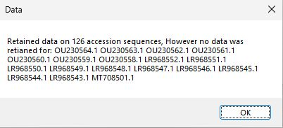
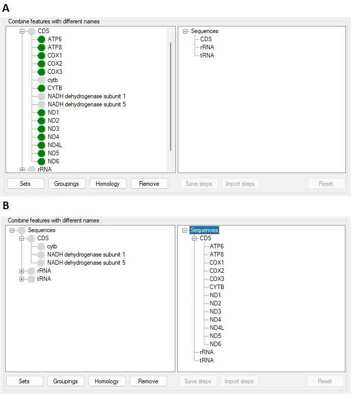

# GeneMatrix User Guide

## Contents

## User interface


Figure 1

<hr />

```GeneMatrix``` consists of a single window split in to four sections: ***Import data***, ***Combine features with different names***, ***Save sequence*** and ***Align individual features***. Each section performs a task as suggested by its name. The upper three section need to be performed in a set order so only the ***Import data*** option is active. However, since the ***Align individual features*** works with data saved to disk it can be user when required and so is always enabled.

## Obtaining the sequence files

```GeneMatrix``` is designed to work with files downloaded from the NCBI web site that consist of a cohort of related sequences such as mitochondrial genomes from species in the same genus or viruses from the same family. For this guide I downloaded 144 mitochondrial genome sequences for the genus Chelonoidis. A fuller description of the data selection and downloading is [here](obtainingFiles.md). 

## Importing sequence data

The  ***Import data*** section consists of two controls, to import data press the ```Import``` button in the lower right of the panel (blue box Figure 2 a). If the ```Folder``` tick box is unchecked, pressing the ```Import data``` button will result in a file selection dialogue box appearing that will accept files with a *.gb or *.genbank file extension (Figure 2 b), while if checked a folder selection dialogue box shown (Figure 2 c). When importing data from a folder, ```GeneMatrix``` will process any file in the folder with either the *.gb or *.genbank file extension.  


<hr />


Figure 2a: Data is imported by pressing the ```Import``` button.


Figure 2b: If the ```Folder``` tick box is unchecked GeneMatrix requests files


Figure 2 c If the ```Folder``` tick box is checked GeneMatrix requests folder

<hr />

***Note:*** when importing a single file it is expected that the file contains multiple sequence, while when importing a folder of files each file can contain one or more sequences. If the same accession number is present twice, ```GeneMatrix``` will warn you and give the option to abort the process allowing you to remove the multiple sequences or allow you to continue and ignoring the 2nd copy.

Once imported ```GeneMatrix``` states the number of retained entries and lists any with no relevant annotation (contained no tRNA, rRNA or CDS features) which are then it is discard (Figure 3 and see [Feature selection](#features-names) below).

<hr />



Figure 3

<hr />

## Retained data

### Genbank entry level data: accession ID, species name and sequence
When reading an entry, ```GeneMatrix``` identifies the entry's accession number, species name and its sequence as follows:   
* The accession ID is obtained from the line beginning with ___VERSION___.   
* The species name is taken from the line starting with two spaces and then ___ORGANISM___.  
* The sequence is considered as any text after the line starting with ___ORIGIN___ and before the starting with ___\\\\___. When all the features from an entry have been stored the sequence data is discarded. 
 
### Selection of sequences to be retained

The level of annotation in GenBank entries is very variable, some entries only have the sequence and genome level annotation such as accession ID, species taxonomy and submitter details, while other are extensively annotated. For instance in the sequence.gb file downloaded in the [Obtaining the sequence files](obtainingFiles.md), 18 contain no relevant annotation. Not all of the features are relevant to the production of sequence alignments for phylogenetic studies consequently, ```GeneMatrix``` limits the features retain to those tagged with the CDS, tRNA or rRNA. These were selected as they have very well defined starting and ending points, with their sequence consistent between species, whereas features such as  those linked to the ___variation___, ___gene___ and ___misc_feature___ are not for example:

* ___variation___ : not consistent between species
* ___gene___: poorly defined start and end points with interesting sequences present in the ___CDS___ features
* ___misc_feature___: poorly defined feature with variable meaning between entries

#### Feature's Names
Due to variation in the annotation of different GenBank entries, when extracting data for a specific feature ```GeneMatrix``` looks for lines containing the tags: ___/gene=___, ___/product=___,  ___/protein_id=___ and ___/locus_tag=___.  When more than one tag is present, the feature's name is taken as the first tag to be given a value in the order of ___/gene=___ then ___/product=___ then  ___/protein_id=___ and finally ___/locus_tag=___.

#### Protein sequence
Typically a ___CDS___ feature is linked to a protein sequence which is found by searching for the ___/translation=___ tag and retaining the subsequence text until a __&rdquo;__ is found.  Obviously ___tRNA___ and ___rRNAs___ never linked to a protein sequence.  

#### Sequence coordinates
For a short, simple sequence such as a tRNA or mitochondrial CDS, the sequence is present as a single run of nucleotides. In these situations the coordinates simply follow the feature's tag (___CDS___, ___rRNA___ or ___tRNA___) with the start and end points separated by two periods (Table 1). In these cases the coordinates of feature is extracted from the GenBank entry's sequence and stored.  
However, the sequence of a ___CDS___ feature may be contained in a number of exons or in the case of a circular genome a feature may span the beginning and the end of the sequence. In these cases the feature's tag is followed by a series of start/end coordinates separated by commas with the whole series placed in brackets following the word ___join___ (Table 1). In these case the sequence identified each pair of coordinates is extracted and concatenated to form one sequence.  

|Scenario|Example|
|-|-|
|Contiguous sequence on forward strand| 4226..15369|
|Sequence in two exons on forward strand|join(4226..5266,7492..9002)|
|Contiguous sequence on reverse strand| complement(4226..15369)|
|Sequence in two exons on reverse strand|complement(join(4226..5266,7492..9002))|

Table 1: Feature coordinates

If the feature is encoded on the reverse strand, the coordinates are places in brackets following the complement key word. In these cases the sequence is extracted as above and then the reverse complement sequence is determined and stored. Table 2 gives the conversion table including the ambiguous codes.  

|Base in Genbank<br />sequence|Represents|Base after reverse<br />complementing |Represents|
|-|-|-|-|
|A||t||
|C||g||
|G||c||
|T||a||
|R|A + G|Y|C + T|
|Y|C + T|R|A + G|
|K|T + G|M|A + C|
|M|A + C|K|T + G|
|W|A + T|W| A + T
|S| C + G|S| C + G|
|B |T + C + G|V|A + C + G|
|D|A + T + G|H|A + T + C|
|H|A + T + G|D|A + T + G|
|V|A + C + G| B|T + C + G|
|White space or 0 to 9|(Formatting)|Ignored|NA|
|N or any other character|A + C + G + T|N|A + C + G + T|  

Table 2: Sequence substitution when reverse complementing a sequence 

Occasionally, the exact coordinates for a sequence are not know, in these cases the coordinates may contain one or both < > characters suggesting the sequences starts or end beyond the region suggested. In these situations ```GeneMatrix``` just uses the coordinates supplied i.e. the entry: <1..532 would be treated as: 1..532.   
In the data file downloaded in the [Obtaining the sequence files](obtainingFiles.md) section, sequence MG912796.1 contains the sequence for a tRNA-Leu as located at ***complement(<13358)***, in this case with so little information the tRNA is ignored.


## Working with the retained data

Once the data has been imported, the ```Combine features with different names``` section becomes active. The area consists of two tree view with the data arranged as nodes in a tree like structure. The root of the trees is the ___Sequence___ node, which contains up to three child nodes (___CDS___, ___rRNA___ and ___tRNA___). The panel on the left represents  unselected data, while the panel on the right represents the selected features. Consequently, the ___CDS___, ___rRNA___ and ___tRNA___ nodes on the right contain no child nodes, while those on the left do as shown by the cross to the right of the text (Figure 4).

<hr />


Figure 4

<hr />

```GeneMatrix``` is designed for the collation of orthologue sequences, which is done with user interaction by selecting features with the required names rather than its sequence. This decision was made as it is hoped that the sequences would be correctly annotated, and while this may not be the case, there are many situation where the use of sequence homology can be equally troublesome. For instance, many viruses contain open reading frames which give rise to a number of different proteins though different mechanisms such as RNA editing, ribosome stalling or protein cleavage. What these features are represent is typically obvious from the feature's name, but may not be that obvious from the sequence, for example:  
* The CDV virus genome contains a PVC or PCV open reading frame that generates the P, V and C proteins which have overlapping sequences. Some CDV genomes in the [CDV_genomes.gb](../ExampleData/CDV_genomes.gb) file contains a PVC/PCV feature, while other have one or more of the P, V, and C sequences. Trying group these features base on sequence homology could result in situations where some species have the whole PVC/PCV sequence included while others had the overlapping P, V and C sequences with or without the PVC/PCV sequence, which could ultimately result in erroneous results.  
  
## Selecting sequences based on their names

Ideally, ```GeneMatrix``` would automate the selection of the features based on their name, this step requires user interaction as the same orthologue may have multiple names. For example, in the [CDV_genomes.gb](../ExampleData/CDV_genomes.gb) file, different GenBank entries have eight different names for the Haemagglutinin protein H sequence. 

<hr >


Figure 5: 

<hr />

Multiple features can be selected at once as long as they all are the same type (i.e. they are all ___CDS___ features.) To select an orthologue for inclusion in the exported data set, left mouse click on the relevant node's name in the left hand panel, this should change the node's icon from a light grey to a a green disc. Clicking on the node a second time will deselect it as indicated by the light grey icon. (If an orthologue has multiple names, initially select the node which has the preferred name and then include the other sequences as outlined in the next section). Once you have selected all the features, left mouse click on the relevant node in the right hand panel. This will remove the features from the left hand tree and add them to the right hand tree (Figure 6).  

<hr />



Figure 6: In Figure 6 a, all the features in the ___CDS___ set except ***cytb*** have been selected. Figure 6 b shows the movement of the selected nodes to the right hand tree after left mouse clicking on the CDS node in the right hand panel.

### Combining sequences with different names

In Figure 6 a, it can be seen that one or more GenBank entries contain a feature called ***cytb***, while the rest contain a ***CYTB*** feature. Since these probably refer to the same probably refer to the same orthologue, its possible to combine them as one entity by first moving the ***CYTB*** node to the right hand tree and then selecting the ***cytb*** node  (Figure 7 a)and then left mouse clicking on the ***CYTB*** node in the right hand panel. This will then remove the ***cytb*** node from the left hand tree and add it as a child of the ***CYTB*** node in the right hand tree (Figure 7 b).

<hr />


Figure 7

<hr />

### Deselecting sequences

Removing a feature from the right hand is achieved by right mouse clicking on the node. This removes the node from the right hand tree, returning it to left hand tree. If a node contains child nodes, these are removed from the node and also placed in the left hand tree (Figure 8). 

<hr />


Figure 8: Right mouse clicking on the ***CYTB*** node in the right hand panel (Figure 8 a), returns bore the the ***CYTB*** node and its child ***cytb*** to the ***CDS*** node on the left hand panel.

<hr />


### Resetting the selection

### Saving the selected gene sequences

## Aligning the sequences in the exported files

### Using Muscle

### Using Clustal

### Combining the individual alignments 
