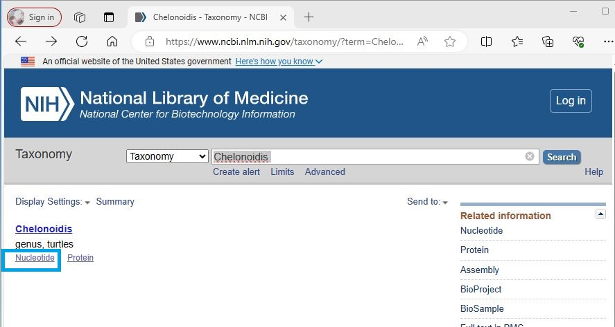
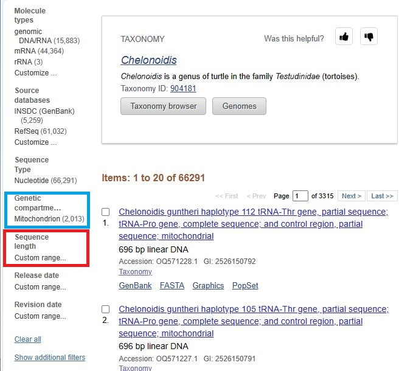
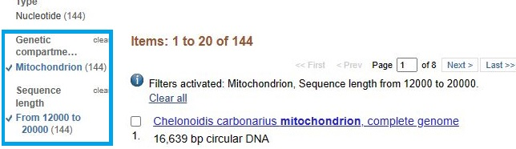
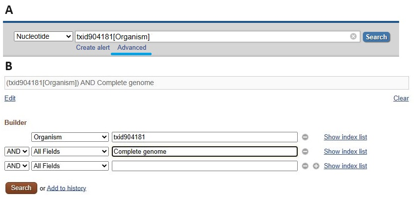
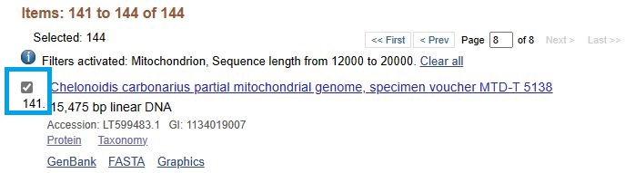
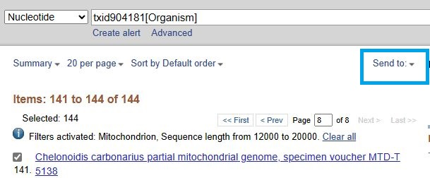
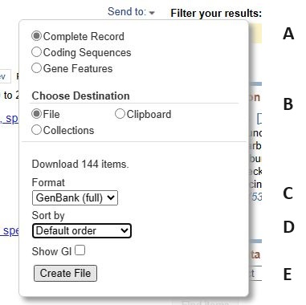

# Obtaining the sequence files

[Back to user guide](ReadMe.md#obtaining-the-sequence-files)

## Introduction

```GeneMatrix``` is designed to work with files downloaded from the NCBI web site that consist of a cohort of related sequences such as mitochondrial genomes from species in the same genus or viruses from the same family. The NCBI is a large site that as multiple ways to access the same data depending how you want to search for it. In this example I will create a single GenBank sequence file containing mitochondrial genomes for turtles in the **Chelonoidis** genus. This guide wil show you haw to get the entries, but makes no attempt to filter them based on duplicate entries for the same species or poor annotation.

### Selecting the sequences

First navigate to the NCBI Taxonomy site ([ NCBI - Taxonomy](https://www.ncbi.nlm.nih.gov/taxonomy)) and enter **Chelonoidis** in the search bar and press the ```Search``` button (Figure 1).

<hr />



Figure 1

<hr />

Next click on the ___Nucleotide___ link (blue box in Figure 1) below the ___Chelonoidis___ title to navigate to the next page. This page lists all the nucleotide sequences available for species in this genus with 66,291 available. Many of the sequences do not represent mitochondrial genomes and so the results require filtering using the option on the left of the web site (Figure 2) 

<hr />



Figure 2

<hr />

Limiting the sequences to those linked to the key word ___Mitochondrion___ reduces the list to 2,013 sequences (blue box Figure 2), while selecting a size range (red box Figure 2) of 12,000 to 20,000 bp reduces it 144 (Figure 3).

<hr />



Figure 3

<hr />

It is also possible to use a more refined search query using the ***Advanced*** option (blue line in Figure 4 a), for instance in Figure 4 b the phrase 'Complete genome' has been added to the search. This returns 25 sequences, however, not all complete genomes will necessarily be tagged with the phrase and so some will be missed. Also, while not complete, nearly complete genome sequences may offer a valuable insights. Consequently, Filtering should be done to return a manageable number of sequence that can then be filtered by eye.

<hr />



Figure 4

<hr />

It is now a matter of going through the list and selecting entries of interest by checking the tick box to the left of the sequence's name (blue box Figure 5). Since this data will not be used beyond this user guide I have unquestioningly selected all 144 sequences, but would normally attempt to remove duplicate entries especially those with poor annotation and erroneously included unrelated sequences.

<hr />



Figure 5

<hr />

### Downloading the sequences

Once selected, you must use the ***Send to*** option to select the format and start the download (blue box Figure 6)

<hr />



Figure 6

<hr />

Clicking on the inverted triangle icon reveals a download options menu which expands as you select specific options (Figure 7). You need to select options as outlined in Table 1 and Figure 7.

<hr />



Figure 7

|Option|Line in Figure 7|
|-|-|
|***Complete Record*** |Line 'A'|  
|***File***|Line 'B'| 
|***GeneBank (full)***|Line 'C'|
|***Default order***|Line 'D'|
|***Create file***|Line 'E'|

Table 1

<hr />

When all the options have been selected press the ***Create File*** button (line 'E', Figure 7) which will prompt the browser to download the file. Since the data file will be called "sequence.gb" it usually a good idea to move and rename to stop it been overwritten by subsequent downloads.

## Example data

A copy of the downloaded files is available [here](../ExampleData/) along with file containing 229 CDV genomes.

[Back to user guide](ReadMe.md#obtaining-the-sequence-files)
