# GeneMatrix tutorial

This tutorial is a slimmed‑down version of the [user guide](ReadMe.md), which provides a complete description of GeneMatrix but is not always easy to follow. The tutorial therefore omits certain details and is written for ease of use rather than completeness. If you encounter problems when analysing your data, you may wish to consult the full guide.

## Starting point
Download the program (GeneMatrix6_4.exe) from the [Program folder](../Program/) and the Chelonoidis_mtgenomes.gb GenBank data file from the [ExampleData](../ExampleData/) folder.   

- The Chelonoidis_mtgenomes.gb file contains ~70  mitochondrial genomes.  

- Due to security restrictions in Windows, you may need to save GeneMatrix_64.exe to a hard diive rather than a USB stick or network drive.

## 1. Importing data

Once GeneMatrix has started, make sure the __Extend CDS__ option is selected, then press the __Import__ button in the top right corner (Figure 1a).

Figure 1a: Import a data file by pressing the __Import__ button.

---

After selecting the data file, GeneMatrix reads the file and reports any issues in a dialog box. In this example, two genomes contain sequence but no annotation (Figure 1b). Press __OK__ to close the dialog box.

Figure 1b: Example of an import warning showing genomes with sequence but no annotation.

---

## 2. Checking for duplicated sequences and sequence fragments

You can check for duplicated gene sequences linked to a gene name by first clicking on the gene name in the left‑hand tree view to select it. If sequences for a gene or feature are associated with two different labels (e.g., _CYTB_ and _cytb_), select both labels (Figure 2a). Then press the __Sets__ button below the left‑hand tree view. 

 A window will appear listing each sequence by accession ID, species of origin and gene name, along with its length, deviation from median length and its assigned set (Figure 2b). 

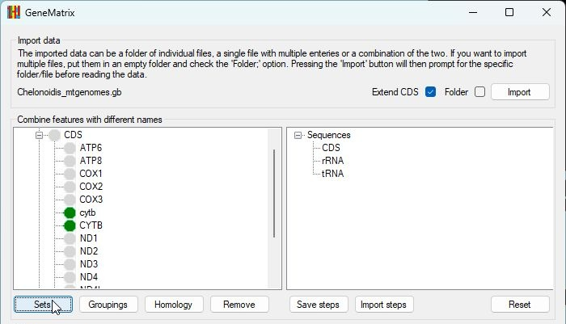

Figure 2a: To check for duplicates and sequence fragments, first select the sequences linked to a single gene and then press the __Sets__ button.

---

Figure 2b: Each sequence is allocated to a set based on its sequence and length.

---

Figure 2b shows the results of the analysis of _CYTB_ in the Chelonoidis_mtgenomes.gb files. The important points are the following:   
- The 2nd to 5th sequences are all in set 2, meaning that they are identical (green box in Figure 2b). 
- The sequence for MT017704.1 (blue line in Figure 2b) is shorter than the others, and its sequence matches part of the sequences in set 8, indicating it is likely a fragment of the set 8 sequence.

You can save this data by pressing the __Save__ button. A set of results files can be found in the [ExampleData → Comparisons](../ExampleData/Comparisons/) folder.

## 3. Checking for duplicated genomes

If data for multiple sequences is collected and saved into the same empty folder, GeneMatrix can group mitochondrial genomes into sets that contain identical gene sequences. This allows you to identify duplicated genomes within the dataset. To do this, press the __Groupings__ button and select the folder containing the files saved from step 2 (Figure 3a).

Once the folder has been selected, GeneMatrix will determine which genomes contain identical sequences and will assign a Group ID to each unique genome sequence (Figure 3b). For example, Group ID 13 contains four mitochondrial genomes (blue box in Figure 3b).

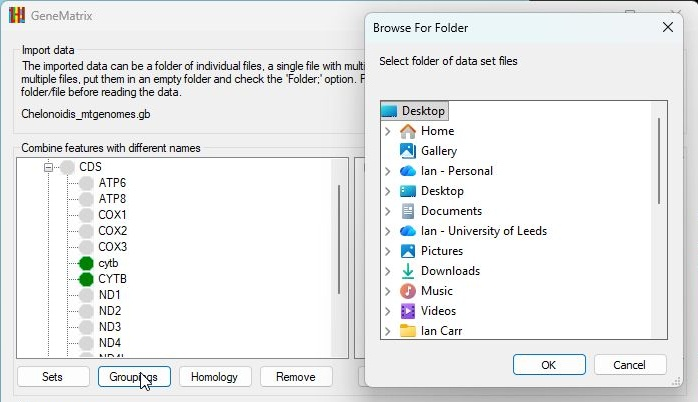

Figure 3a: To group genomes with identical sequences, press the __Groupings__ button and select the folder of files saved from step 2.

---

. 

## 4. Removing duplicated and fragmented genomes

Once the gene sequences or genomes have been placed into sets of identical sequences, you can then create a file containing a list of GenBank accession IDs (one per line) that can be removed from the analysis (e.g., [DuplicatedSequences.txt](../ExampleData/Comparisons/DuplicatedSequences.txt)). These GenBank entries can then be removed by pressing the __Remove__ button below the left-hand tree view and selecting the file.

## 5. Selecting genes and/or features for analysis

Once the data file has been read, the annotated features (_CDS_, _rRNA_, and _tRNA_) are listed under their respective nodes in the left‑hand tree view (Figure 5a). Double‑clicking a node expands it to display all sequence names linked to that feature type (Figure 5b).

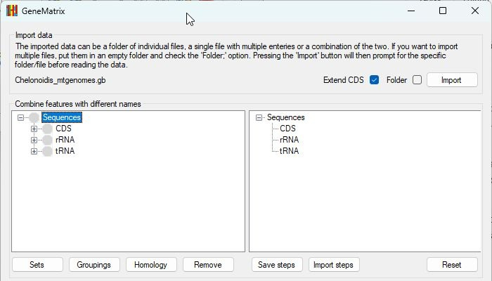

Figure 5a: Annotated features are listed under the appropriate nodes in the left‑hand tree view.

---

Figure 5b: Double‑clicking a _CDS_, _rRNA_, or _tRNA_ node displays all sequence names linked to that feature.

The genes _ATP6_, _ATP8_, COX1, _COX2_ and _COX3_ all appear to use consistent naming. To select these genes, click each node in turn (green highlight in Figure 5c) and then click the _CDS_ node in the right‑hand tree view to move the selected sequences into the right‑hand selected list (Figure 5d).

Figure 5c: Clicking a node in the left‑hand tree view selects all sequences with that name.

---

Figure 5d: Clicking on the equivalent node in the right-hand tree view moves the selected sequences to the right-hand tree view.

Two gene names appear for cytB: _CYTB_ and _cytb_. To combine these into a single gene set:  
- Click the _CYTB_ node in the left‑hand tree view (Figure 5e).   
- Click the _CDS_ node in the right‑hand tree view to move _CYTB_ sequences to the selected list (Figure 5f).  
- Next, click the _cytb_ node in the left‑hand tree view (Figure 6g).  
- Then click the _CYTB_ node in the right‑hand tree view (Figure 6h).  

This merges sequences labelled _CYTB_ or _cytb_ into a single unified gene set.

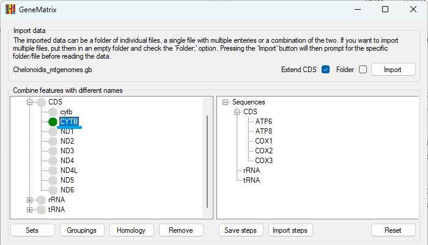

Figure 65e: Select the _CYTB_ node in the left‑hand tree view.

---

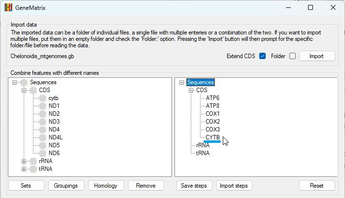

Figure 5f: Click the _CDS_ node in the right‑hand tree view to move _CYTB_ sequences across.

---

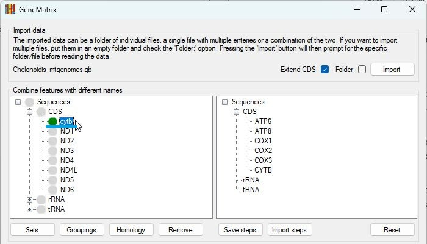

Figure 5g. Select the _cytb_ node in the left‑hand tree view.

---

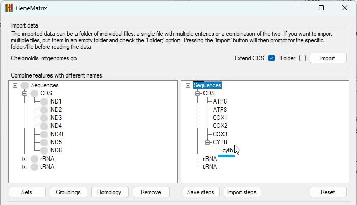

Figure 5h:  Click the _CYTB_ node in the right‑hand tree view to merge _cytb_ sequences into the _CYTB_ group.

---

## 6. Saving the selected sequences to multiple-sequence FASTA files

Once all the required sequences have been selected (heir gene names appear in the right-hand tree view), you can save their DNA sequences—and, where applicable, their amino-acid sequences—to multiple-sequence FASTA files.

To do this, choose the required option (__Just DNA sequences__, __Just protein sequences__ or __Both types of sequences__) and then press the __Save__ button (Figure 6). GeneMatrix will prompt you to select a folder to save the data to and will then create one FASTA file per gene. For example see the files in the [ExampleData → fastafiles folder](../ExampleData/fastaFiles/). 

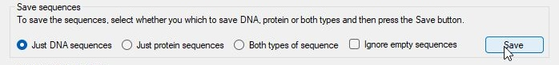

Figure 6: Selecting  __Just DNA sequences__ and pressing the __Save__ button saves the DNA sequences to multiple sequence FASTA files.

---

## 7. Create multiple-sequence alignments for each FASTA file

<b>Note: When you first use _GBlocks_ or an alignment program, you will be asked to select its executable file (\*.exe or \*.bat) as described in the [Guide](../Guide/ReadMe.md#selecting-the-executable-file).</b>

GeneMatrix can automate the construction of multiple-sequence alignments using four different aligners: _MAFFT_, _PRANK_, _MUSCLE_, or _ClustalW_ and can optionally clean the resulting alignments using _GBlocks_.

In this tutorial, the alignments will be created using _MAFFT_ and then cleaned with GBlocks. To do this, check the __Clean with GBlocks__ option and press the __MAFFT__ button (Figure 7). You will then be prompted to select the folder containing the FASTA files.

 Once the folder is selected, GeneMatrix will create a series of batch files that are executed in a Windows CMD terminal to generate each alignment. After the alignments are produced, they are processed by GBlocks. 
 
When using _MAFFT_, the alignment files will have the \*.fasta extension. The cleaned alignments produced by _GBlocks_ will have a \.fa extension, along with an accompanying webpage (*.htm) describing the alignment. 
 
 The results of the alignments can be seen in the [ExampleData → MAFFT_GBlocks](../ExampleData/MAFFT_GBlocks/) folder.

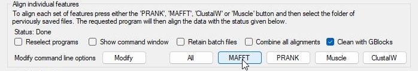

Figure 7: Selecting the __Clean with GBlocks__ option and pressing the __MAFFT__ button prompts you to select the folder of FASTA files saved in step 6. 

---

## 8. Analysing the alignments with PartitionFinder2

<b>Note: When you first use _PartitionFinder2_, you will be asked to select its executable file, as shown in the [guide](../Guide/ReadMe.md#selecting-the-executable-file). _PartitionFinder2_ also requires _Python 2.7_, which is commonly installed via _Anaconda_.</b>

Once the alignments have been created, GeneMatrix can automate the use of _PartitionFinder2_ to determine the optimal parameters for subsequent phylogenetic analysis. This is a two‑step process:   
- Create the PartitionFinder2 configuration file.   
- Run PartitionFinder2 with the configuration file.

These steps are performed using the __Make__ and __Run__ buttons (Figure 8).

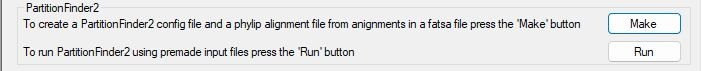

Figure 8: Using _PartitionFinder2_ to determine the optimal parameters for subsequent phylogenetic analysis is a two-step process performed using the __Make__ and __Run__ buttons. 

---

### 9. Making PartitionFinder2 configuration file

Pressing the  __Make__ button opens the __PartitionFinder__ window (Figure 9a). First select the file extension used by your alignments. In this case the alignments have been processed by _GBlocks_ and therefore have the \*.fa extension. Then press the __Folder__ button to select the folder containing the alignments (blue line in Figure 9a).   

Once the folder has been selected, the __Create__ button becomes active. Pressing it generates the required \*.blocks and \*.phy files required in the next step. 

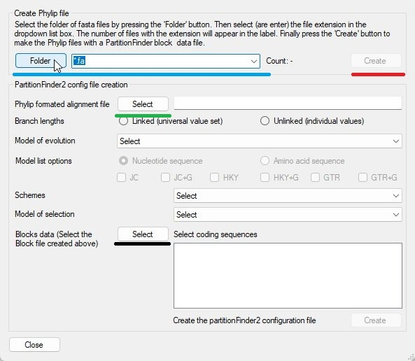

Figure 9a: The __PartitionFinder__ window allows you to select the folder of alignment files as well as the files' extension (blue line).

---

After the two files have been created, press the __Select__ button (green line in Figure 9a) to choose the CDS-.phy file you just generated. Next, choose the required parameters and options from the lists in the __PartitionFinder__ window. These should be selected in order from top to bottom, as some options are mutually exclusive.

Finally, press the lower __Select__ button (black line in Figure 9a) to choose the _CDS-.blocks_ file created at the start of this section. This will populate the checkbox list, allowing you to choose which alignments to include in the _PartitionFinder2_ analysis.

Once all options and alignments have been selected, the __Create__ button (blue line in Figure 9b) becomes active, allowing you to generate the final configuration file for _PartitionFinder2_.

The CDS-.blocks, CDS-,phy and partition_finder.cfg created by this tutorial are present in the [ExampleData → MAFFT_GBlocks](../ExampleData/MAFFT_GBlocks/) folder.

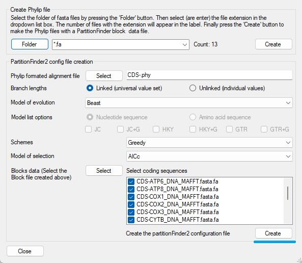

Figure 9b:  Once all options and alignments have been selected, the _PartitionFinder2_ configuration file can be created. (Options shown in Figure 9b are for illustration only and should not be considered a valid selection.)

---

### 10. Running PartitionFinder2

To run _PartitionFinder2_, press the __Run__ button (Figure 8). You will be prompted to select the folder containing the alignment files; this folder must also contain the PartitionFinder2 configuration file created in the previous step. 

GeneMatrix will then open the __Options__ window (Figure 10a), which allows you to select the _Python_ environment, modify the analysis settings, save the batch file, or run _PartitionFinder2_ directly.

_PartitionFinder2_ currently (2026) requires _Python 2.7_. Because _Python 2.7_ is now deprecated and many required packages have been removed from standard distributions, the most reliable way to run _PartitionFinder2_ is within an _Anaconda_ environment as described [here](../Guide/installinPython2.7.md).

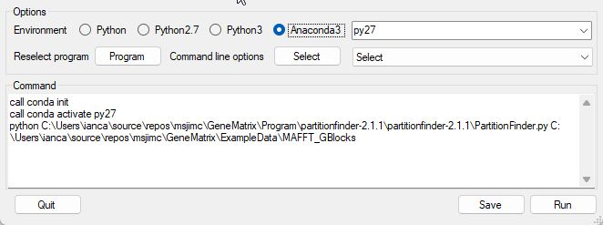

Figure 10a: The __Options__ window allows you to select the appropriate _Python_ environment and modify the command used to run _PartitionFinder2_.

---

Pressing the __Run__ button in this window will start _PartitionFinder2_. When the analysis is complete, the program will export its results to a folder named '_analysis_' inside the directory containing the alignments and configuration file. This [ ExampleData → analysis](../ExampleData/analysis/) contains the output from this tutorial. This folder also contains the log.txt, file which is typically located next to the _PartitionFinder2_ configuration file.