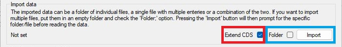
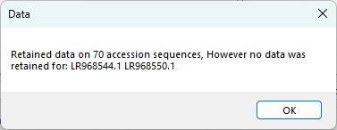
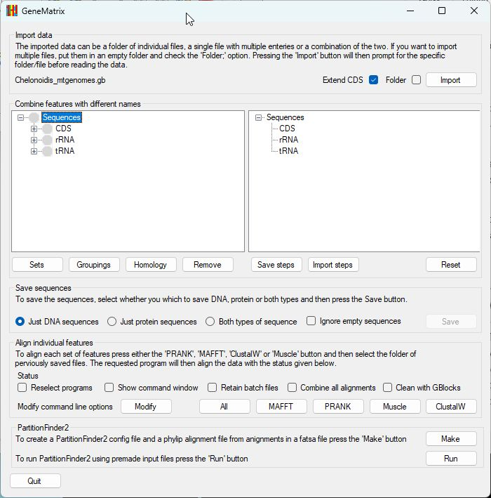
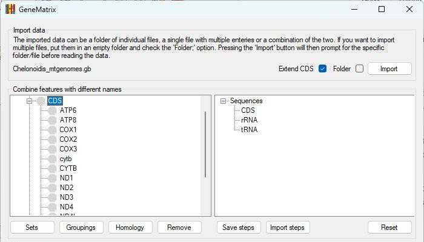
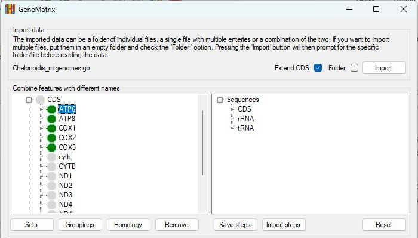
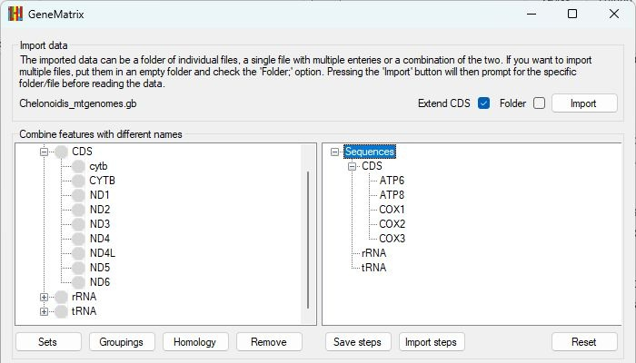
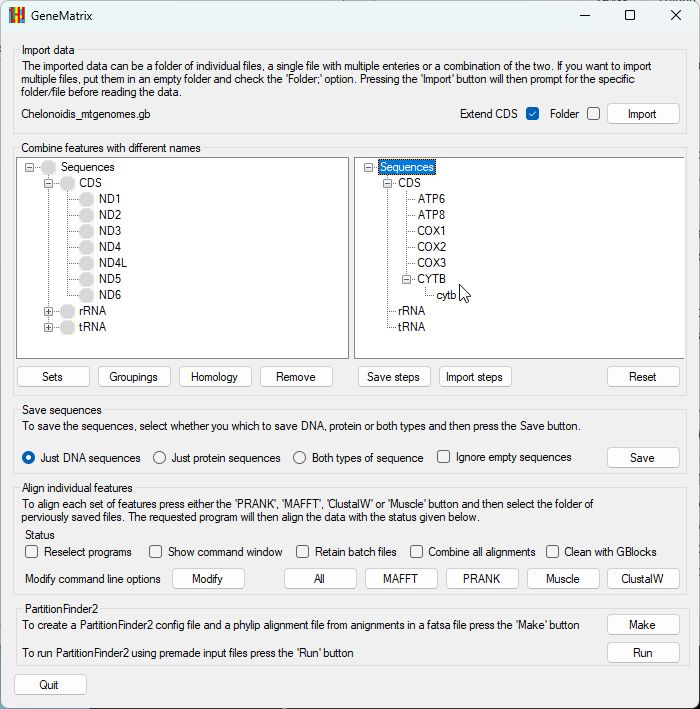

# GeneMatrix tutorial

This tutorial is a slimmed down version of the [user guide](ReadMe.md), which is complete description of GeneMatrix and so is not necessarily easy to follow. The tutorial, therefore omits certain details and is write for ease of use rather than completeness. If you run in to issues when analysing your data you may want to check the guide for help.

## Starting point
Download the program (GeneMatrix64.exe) from the [Program folder](../Program/) and the Chelonoidis_mtgenomes.gb genbank data file from the [Exampledata](../ExampleData/) folder.   

- The Chelonoidis_mtgenomes.gb file contains ~70 of mitochondrial genomes.  

- Due to security restrictions in Windows, you may need to save GeneMatrix64.exe to a hard drive on your computer rather than a USB stick or network drive.

## Importing data

Once GeneMatrix has started, make sure the __Extend CDS__ option is selected and then press the __Import__ button in the top right corner(Figure 1).

Figure 1: Import a data file by pressing the __Import__ button.

Once the data file has been selected, it is read and any issues shown in a dialog box, in this case two genomes contained sequence but no annotation (Figure 2). Press __OK__ to close the dialog box.

Figure 2: Import a data file by pressing the __Import__ button.

## Selecting genes and or features

Once the data files has been read, the annotated features (CDS, rRNA and tRNA) are listed in the appropriate node in the left-hand tree view (Figure 3a). Double clicking on a node will open the node to display all the sequence names linked to that type of feature (Figure 3b).

Figure 3a: Annotated features are listed in the appropriate node in the left-hand tree view.

---

Figure 3b: Double clicking on a node will open the node to display all the sequence names linked to that type of feature.

The genes linked to _ATP6_, _ATP8_, COX1, _COX2_ and _COX3_ all appear to use the same name. Consequently, click on each of the nodes in turn to select then (green disc in Figure 4a) and then click on the _CDS_ node in the right-hand tree view to mve the sequences to the right-hand 'Selected list' (Figure 4b).

Figure 4a: Clicking on a node in the left-hand tree view selects the sequences with that name.

---

Figure 4b: Clicking on the equivalent node in the right-hand panel moves the selected sequences to the right-hand tree view.

Two possible gene names appear of cytB - _CYTB_ and _cytb_. to create a single group of cytB genes first select the node labelled _CYTB_ (Figure 5a) and then click the 'CDS' node in the right-hand window to select it (Figure 5b). Next click the node labelled _cytb_ (Figure 5c) and then click the _CYTB_ node in the right-hand window (Figure 5d). This will combine the sequences labelled _CYTB_ oe _cytb_ in to a single gene set.

Figure 5a: Click on the _CYTB_ node in the left-hand tree view to select it.

---

Figure 5b: Click on the _CDS_ node in the right-hand tree view to move the _CYTB_ node to the right-hand tree view.

---

Figure 5a: Click on the _cytb_ node in the left-hand tree view to select it.

---

Figure 5d: Click on the _CYTB_ node in the right-hand tree view to move the _cytb_ node to the _CYTB_ node.

## Checking for duplicated sequences or sequence fragments

Once you have selected some sequences, you can check for duplicated sequences by pressing the __Groupings__ button below the left-hand tree view. This will prompt you to select a folder to save the results to. Once a folder has been selected, GeneMatrix will compare the sequences in each node (i.e., the _ATP6_, _ATP8_, _COX1_, _COX2_, COX3 and _CYTB_) checking for exact matches or sequence fragments and saves the results to a series of text files named after each node's name. A set of results files can be found in the [ExampleData > Comparisons](../ExampleData/Comparisons/) folder.

These files

