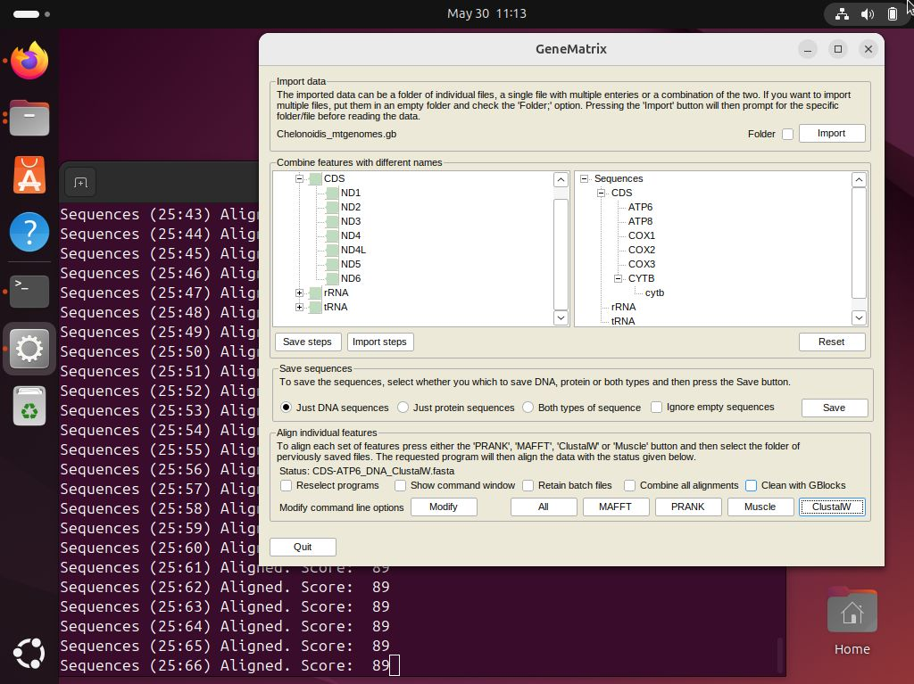

# Running ```GeneMatrix``` on a Linux desktop

While ```GeneMatrix``` is written in  c#.NET and so geared to run on a Windows PC, it is possible to run any Windows application on Linux or macOS using [```Wine```](https://www.winehq.org/). 

This GitHub repository gives brief guides to installing Wine on arrange of Linux systems as well as FreeBSD and macOS.

* [Running GeneMatrix on Linux, FreeBSD and macOS computers](https://github.com/msjimc/RunningWindowsProgramsOnLinux)

## Different behaviour between running ```GeneMatrix``` on Linux compared to Windows.

One important difference between using ```GeneMatrix``` on Linux compared to Windows is that when a third party aligner is used, the program's output appears in the same terminal used to start ```GeneMatrix``` and not a  Windows like command shell. Consequently, there is little point in selecting the``` Show command window``` option (Figure 1).    

<hr />



Figure 1: ```GeneMatrix``` aligning mitochondrial sequences with ClustalW2.exe on Ubuntu using Wine. Notice the user feedback from ClustalW2 is displayed in the terminal used to start ```GeneMatrix``` and not a Windows terminal.

<hr />

***Note:*** PRANK does not seem to run in the Wine environment, but can be run natively with the scripts provided in the [Scripts folder](../Program/scripts/) as mentioned [below](#running-the-alignments-natively-on-linux-system).

## Installation of aligners and ```GBlocks``` on Linux for use by ```GeneMatrix```

Even though the programs are running on a Linux machine, they are running under the umbrella of Wine as Window's applications. This means that you need to download the Windows version of the programs not Linux versions. You can do this by either downloading the versions from this [GitHub repository](../Program/) or from the program's download page. For programs like ClustalW which come as a "*.msi" installation file, install them using Wine. For example if the ClustalW installation file: **clustalw-2.1-win.msi** is downloaded to your Downloads folder, install it using this command:

> wine ~/Download/clustalw-2.1-win.msi 

This will open the standard Windows installer dialogue box and then install Clustalw2.exe in ~/.wine/drive_c/Program Files (x86)/Clustalw2 folder. When importing the file's location in to GeneMatrix select the path: **Desktop > My Computer > (C:) > Program Files (x86) > Clustalw2 > Clustalw2.exe**. 

## Running the alignments natively on Linux system

While you can instruct ```GeneMatrix``` to direct the alignments using the third party aligners on Linux, you can also perform the alignments manually using the scripts in the [Programs > scripts](../Program/scripts) folder. This requires the Linux versions of the aligners to be installed on the Linux system as suggested [here](../Program/scripts/README.md). 


