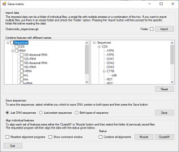

# Gene matrix

## Contents

- [Introduction](#Introduction)
- [Guide](Guide/ReadMe.md)
- [Download](Program/README.md)
- [Running on Linux](#running-on-a-linux-computer)

## Introduction 



```GeneMatrix``` allows the rapid extraction of gene-specific sequences from either a folder of GenBank sequence files, a single GenBank file containing a series of entries, or a combination of the two. The program is specifically designed to process files downloaded from the NCBI site in the GenBank format. While a number of applications export data in this format, differences in formatting and annotation style may lead to errors during processing.  ```GeneMatrix``` requires both the annotation and sequence to be present in the file.  

Once imported, ```GeneMatrix``` extracts each DNA and/or protein feature linked to the CDS, tRNA or rRNA feature types and allows sequences with the same or related names to be exported as a single multi-sequence FASTA file such that the file contains all the sequences linked to a specific gene. The program can then direct the alignment of these files by ***ClustalW2*** ***PRANK***, ***MAFFT*** or ***Muscle*** (if present on the same computer), and if more than one gene feature was exported, combine the results of their alignments to form a super-alignment that could be used in a range of fields such as phylogenetic analysis. EIf prompted, GeneMatrix will also direct the cleaning of the alignments by GBlocks (if present on the computer).

## Guide

The user guide is [here](Guide/ReadMe.md).

## Download

The prebuilt program can be downloaded [here](Program/README.md).

## Running on a Linux computer

GeneMatrix can run on Linux with the help of Wine as described [here](Linux_with_Wine/README.md)