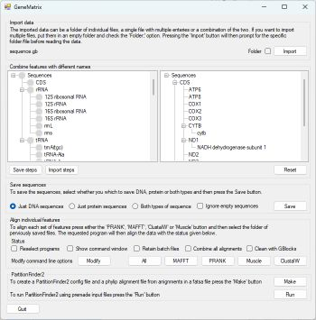

# Gene matrix

## Contents

- [Introduction](#Introduction)
- [Guide](#guide)
- [Download](#download)

## Introduction 



```GeneMatrix``` allows the rapid extraction of gene specific sequences from either a folder of sequence files, a single file containing a series of sequences or a combination of the two. The program is specifically designed to process files downloaded from the NCBI site in the GenBank format. These files require both the annotation and sequence to be present.  

Once imported, ```GeneMatrix``` extracts each DNA and/or protein feature linked to the CDS, tRNA or rRNA feature types in the files and allows sequences with the same or related names to be exported as single a multi-sequence fasta file such that the file contains all the sequences linked to a specific gene. The program can then direct the alignment of these files by ClustalW2 or Muscle (if present on the same computer) and if more than one multi-fasta file is present, combine the results of their alignments together to form a super-alignment that could be used in phylogenetic studies.

## Guide

The user guide is [here](Guide/README.md).

## Download

The prebuilt program can be downloaded [here](Program/README.md).

